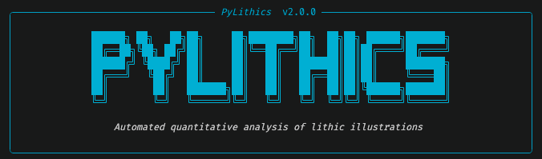

[](https://www.gnu.org/licenses/gpl-3.0)
[](https://app.travis-ci.com/alan-turing-institute/Palaeoanalytics)
[](https://alan-turing-institute.github.io/Palaeoanalytics/)


<p align="center">
  
</p>

<h3 align="center">Version 2 out now</h3>

# Quick start

```bash
# Clone, install, run
git clone https://github.com/alan-turing-institute/Palaeoanalytics.git
cd Palaeoanalytics
pip install .
pylithics
```

```bash
# Upgrade from version 1.0
cd Palaeoanalytics
git pull
pip install . --upgrade
```


# [Click Here to View Full Documentation and Searchable User Guide](https://alan-turing-institute.github.io/Palaeoanalytics/)


# Software License <a name="license"></a>

This software is licensed under the terms of the [GNU General Public License v3.0 (GNU GPLv3)](https://choosealicense.com/licenses/gpl-3.0/).
