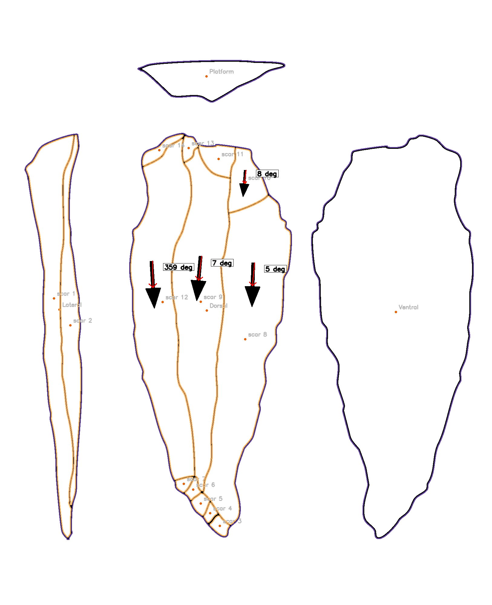

<h1 align="center">Welcome to Palaeoanalytics! </h1>

> Repository for the [Paleoanalytics project](https://www.turing.ac.uk/research/research-projects/palaeoanalytics). 
>A collaboration between The Alan Turing Institute and the University of Cambridge.  

[](https://www.gnu.org/licenses/gpl-3.0)
[](https://app.travis-ci.com/alan-turing-institute/Palaeoanalytics)

# **Table of Contents:**

- [About the project](#about)
- [The team](#team)
- [The `PyLithics` package](#pylithics)
- [Drawing style for PyLithics](#drawing)
- [Contributing](#contributing)
- [Licence](#licence)

# 📖 About the project <a name="about"></a>
Archaeologists have long used stone tools (lithics) to reconstruct the behavior of prehistoric hominins. While techniques 
have become more quantitative, there still remain barriers to optimizing data retrieval. Machine learning and computer 
vision approaches can be developed to extract quantitative and trait data from lithics, photographs and drawings. `PyLithics`
has been developed to capture data from 2D line drawings, focusing on the size, shape and technological attributes of flakes. 

`PyLithics`is an open-source, free for use, software package for processing lithic artefact illustrations scanned from 
the literature. This tool accurately identifies, outlines, and computes lithic shape and linear measures, and returns user 
ready data. It has been optimized for feature extraction and measurement using a number of computer vision techniques 
including pixel intensity thresholding, edge detection, contour finding, custom template matching and image kernels. 
On both conventional and modern drawings, `PyLithics`can identify and platform, lateral, dorsal, and ventral surfaces,
as well as individual dorsal surface scar shape, size, orientation, diversity, number, and flaking order. Complete size
and shape metrics of individual scars and whole flakes can be calculated and recorded. Orientation and flaking direction 
of dorsal scars can also be calculated. The resulting data can be used for metrical analysis, extracting features indicative
of both typologies and technological processes. Data output can easily be employed to explore patterns of variation within and between assemblages.

# 👥 The team <a name="team"></a>

These are the members of the Palaoanalytics team as updated August 2021:

| Name | Role | email | Github | 
| --- | --- | --- | --- |
| Jason Gellis | Postdoctoral Researcher (University of Cambridge) | [jg760@cam.ac.uk](mailto:jg760@cam.ac.uk) | [@JasonGellis](https://github.com/JasonGellis) |
| Camila Rangel Smith | Research Data Scientist (The Alan Turing Institute) | [crangelsmith@turing.ac.uk](mailto:crangelsmith@turing.ac.uk) |[@crangelsmith](https://github.com/crangelsmith) |
| Robert Foley | Principal Investigator (University of Cambridge) | [raf10@cam.ac.uk](mailto:raf10@cam.ac.uk)| [Rob-LCHES](https://github.com/Rob-LCHES)


# 📦 The `PyLithics` package <a name="pylithics"></a>

> PyLithics: A Python package for stone tool analysis

## Workflow

`PyLithics` is devised to work with illustrations of lithic objects common to publications in archaeology and anthropology. Lithic illustrators have established conventions regarding systems of artefact orientation and proportions. Lithics are normally drawn at a 1:1 scale, with the vertical axis orthogonal to the striking platform. A preferred method is to orient and illustrate various aspects of an artefact as a series of adjacent surfaces at 90-degree rotations from the principal view (usually the dorsal surface). Each aspect contains internal details (i.e., flake scars, cortical areas, etc.), indication of flaking direction radial lines (ripples), and the inclusion of a metric scale (for more information about lithic drawings see [@Martingell1988]). Currently, `PyLithics` is optimised to work with unifacial flakes and bifaces, which are relatively flat, two-dimensional objects. 

The inputs for `PyLithics` are images of lithic objects, images of their associated scales, and a metadata `CSV` file linking the two and giving the scale measurement in millimeters. 

`PyLithics` processes the images with the following steps (and as illustrated in the schema below):

1. Import and match images to associated image ID and scale image from CSV metadata file.
2. Calculate a conversion of pixels to millimeters based on the size of the associated scale from CSV metadata file. If no scale is present, measurements will be in pixels
3. Apply noise removal and contrast stretching to images to minimise pixel variation.
4. Pixel intensity thresholding of images to prepare for contour finding.
5. Apply edge detection and contour finding to thresholded images.
6. Calculate metrics of lithic surface features from found contours -- area, length, breath, shape, number of vertices. 
7. Select contours which outline an entire lithic object's surfaces, or select contours of inner scars greater than 3% and less than 50% of the total size of its surface.
8. Classify these selected surface contours as "Dorsal", "Ventral", "Lateral", and/or "Platform" depending on presence or absence. Assign scar contours to these surfaces. 
9. If present, find arrows using connected components and template matching, measure their angle and assign angle to associated scar.
10. Plot resulting surface and scar contours on the original images for validation.
11. Output data in a hierarchical json file detailing measurements of surface and scar contours. 

Here you can find a schema of the workflow described above:


## Installation
The `PyLithics` package requires Python 3.7 or greater. To install, start by creating a fresh virtual environment.
```
python3 -m venv palaeo
source palaeo/bin/activate
```

Clone the repository.
```
git clone https://github.com/alan-turing-institute/Palaeoanalytics.git
```

Enter the repository and check out a relevant branch if necessary (the `develop` branch contains the most up-to-date stable version of the code, but this branch is fast moving.
If you want to have a stable and static version it is better to use `main` branch).
```
cd Palaeoanalytics
git checkout main
```
Install 'PyLithics'.
```
pip install .
```

**Note**: For Mac users we recommend an OS versions=> 10.14 to prevent build problems. For some OS (e.g. Mojave OSX), the OpenCV installation can take too long, if this is the case you can also install
the library using `pip install opencv=4.5.4.58`. Also, be careful about versions, as older versions of OpenCV can break this code. 

## Running `PyLithics`


`PyLithics` can be run via command line. The following command displays all available options:

```bash
pylithics_run --help
```

Output:

```bash
usage: pylithics_run [-h] -c config-file [--input_dir INPUT_DIR]
                     [--output_dir OUTPUT_DIR]

Run lithics characterisation pipeline

optional arguments:
  -h, --help            show this help message and exit
  -c config-file, --config config-file
                        the model config file (YAML)
  --input_dir INPUT_DIR
                        path to input directory where images are found
  --output_dir OUTPUT_DIR
                        path to output directory to save processed image
                        outputs
  --metadata_filename METADATA_FILENAME
                        CSV file with metadata on images and scales
  --get_arrows          If a lithic contains arrows, find them and add them to
                        the data

```

## 💫 Quickstart 
**In order to provide a quick start we have provided an [example dataset](data) including images, scales and metadata.** You
can run a quick analysis in this dataset by running:

```python
pylithics_run -c configs/test_config.yml --input_dir data --output_dir output --metadata_filename meta_data.csv --get_arrows
```

More generally, given that you have a set of lithics images (and its respective scales), you can run the `PyLithics` processing script with the following:

```python
pylithics_run -c configs/test_config.yml --input_dir <path_to_input_dir> --output_dir <path_to_output_directory> --metadata_filename metatada_file.csv
```

The images found in ```<path_to_input_dir>``` should follow this directory structure:

```bash
input_directory
   ├── metatada_file.csv
   ├── images 
        ├── lithic_id1.png
        ├── lithic_id2.png
        └── lithic_id3.png
            .
            .
            .
        ├── lithic_idn.png
   └──  scales
        ├── scale_id1.png
        ├── scale_id2.png
        ├── scale_id3.png
            .
            .
            .
        └── scale_id4.png


```

where the mapping between the lithics and scale images should be available in the metadata CSV file. 

This CSV file should have as a minimum the following 3 variables:
 
- *PA_ID*: corresponding the lithics image id
(the name of the image file), 
- *scale_ID*: The scale id (name of the scale image file)
- *PA_scale*: The scale measurement (how many centimeters this scale represents).

An example of this table, where one scale corresponds to several images is the following:

|PA_ID | scale_ID  | PA_scale  | 
|------|-----------|-----------|
| lithic_id1    | scale_id1       | 5         | 
| lithic_id2    | scale_id2       | 5         |
| lithic_id3    | scale_id3       | 5         |   


**Note**

In the scenario that the scale and csv file are not available, it is possible to run the analysis only using the images
with the command:

```
pylithics_run -c configs/test_config.yml --input_dir <path_to_input_dir> --output_dir <path_to_output_directory> 
```
lithics image files must still be inside the '<path_to_input_dir>/images/' directory). However, all the measurements will only be
provided as number of pixels. 

The ```test_config.yml``` config file contains the following options:


```yaml

threshold: 0.01
contour_parameter: 0.1
contour_fully_connected: 'low'
minimum_pixels_contour: 0.01
denoise_weight: 0.06
contrast_stretch: [4, 96]

```

The config is optimised to work with the images in an [example dataset](data). If you want to use `PyLithics` with different styles of
drawing you might have to modify this configuration file. You can modify or create your on config file and provide it to the CLI. 

## Output from `PyLithics`

### Output images

Output images are saved in the output directory for validation of the data extraction process. An example of these images
are the following: 

<p float="left">



</p>

### Output data

The output dataset is a JSON file with data for the lithic objects found in an image. The data is 
hierarchically organised by type of surface object (ventral, dorsal, platform). For each 
surface the metrics from its scars are recorded. In [this data output example,](output_example.md) you can find the json file
that results from running `PyLithics` on the above images, with comments to better understand the feature hierarchy and variables. 


# 🖌 Drawing style for `PyLithics` <a name="drawing"></a>

We are working hard in developing methods to cater to all styles of stone tools drawings. However, at the moment `PyLithics`
works best with the following styles:


If you want to help us optimise `PyLithics` for different drawing styles we welcome your [contributions](#contributing)!

# 👋 Contributing <a name="contributing"></a>

We welcome contributions from anyone interested in the project. There are lots of ways to contribute, not just writing code. If you have
ideas on how to extend/improve `PyLithics` do get in touch with members of the team (preferable by email). See our [Contributor Guidelines](CONTRIBUTING.md) to learn more about how you can contribute and how we work together as a community in Github.

# 📝 Licence <a name="licence"></a>

This software is licensed under the terms of the [GNU General Public License v3.0 (GNU GPLv3)](https://choosealicense.com/licenses/gpl-3.0/).


