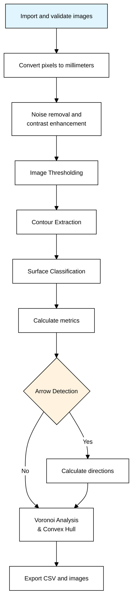

# Basic Usage

## Command Line Basics

### Required Arguments

Every PyLithics run requires these two arguments:

| Argument | Description | Example |
|----------|-------------|----------|
| `--data_dir` | Directory containing images and scales | `pylithics/data` |
| `--meta_file` | Path to metadata CSV file | `pylithics/data/meta_data.csv` |

### Basic Command Structure

Run PyLithics 'out of the box' with minimal configuration:

```bash
python pylithics/app.py --data_dir pylithics/data --meta_file pylithics/data/meta_data.csv
```
This command will:

1. Read metadata from `pylithics/data/meta_data.csv`
2. Load images from `pylithics/data/images/`
3. Load scales from `pylithics/data/scales/`
4. Process according to default settings
5. Output results to `pylithics/data/processed/`

Alternatively, choose your own paths for image and metadata directories:

```bash
python pylithics/app.py --data_dir <path> --meta_file <file> [options]
```

### Scale Calibration Examples

```bash
# Basic analysis with automatic scale detection
python pylithics/app.py --data_dir ./data --meta_file ./metadata.csv

# Force pixel measurements only (skip scale bar detection)
python pylithics/app.py --data_dir ./data --meta_file ./metadata.csv --force_scale_method pixels

# Enable scale detection debugging
python pylithics/app.py --data_dir ./data --meta_file ./metadata.csv --scale_debug

# Process without any calibration (pixel measurements only)
python pylithics/app.py --data_dir ./data --meta_file ./metadata.csv --disable_scale_calibration
```

### DPI Processing Examples

```bash
# Default processing (recommended for archaeological line drawings)
# Uses fixed kernels optimized for 75-600 DPI range
python pylithics/app.py --data_dir ./data --meta_file ./metadata.csv

# Enable DPI-aware scaling for noisy photographs or degraded scans
python pylithics/app.py --data_dir ./data --meta_file ./metadata.csv --enable_dpi_scaling

# DPI scaling with conservative mode (minimal scaling)
python pylithics/app.py --data_dir ./data --meta_file ./metadata.csv --enable_dpi_scaling --dpi_scaling_mode conservative

# DPI scaling with aggressive mode (maximum noise removal)
python pylithics/app.py --data_dir ./data --meta_file ./metadata.csv --enable_dpi_scaling --dpi_scaling_mode aggressive

# Custom DPI parameters
python pylithics/app.py --data_dir ./data --meta_file ./metadata.csv --enable_dpi_scaling --dpi_reference 150 --dpi_max_scale 2.0
```

## Understanding the PyLithics Pipeline

When you run PyLithics, it automatically processes your lithic illustrations through a comprehensive analysis pipeline that extracts contours, classifies surfaces, calculates over 30 morphological metrics, and generates both quantitative data and annotated visualizations for archaeological interpretation.

<div class="grid" markdown>

<div markdown>

### :material-chart-timeline: Processing Flow



</div>

<div markdown>

### :material-information: Step Descriptions

**A. Import and validate images**
Load lithic illustrations and verify file formats, resolution requirements

**B. Scale Calibration & Conversion**
Automatically detect scale bars in images and calculate pixels-per-millimeter conversion factors. Uses pixel measurements if no scale calibration available.

**C. Noise removal and contrast enhancement**
Clean up scan artifacts and improve line definition

**D. Image Thresholding**
Convert to binary (black/white) using simple, Otsu, or adaptive methods

**E. Contour Extraction**
Find object boundaries with parent-child hierarchy (surfaces and scars)

**F. Surface Classification**
Identify dorsal, ventral, platform, and lateral surfaces by size and position

**G. Calculate metrics**
Measure dimensions, areas, aspect ratios, and shape properties

**H. Arrow Detection (Optional)**
Find directional force indicators using resolution-aware computer vision

**I. Calculate directions**
Determine flaking angles and associate arrows with specific scars

**J. Voronoi Analysis & Convex Hull**
Generate spatial distribution patterns and calculate convex properties

**K. Export CSV and images**
Save measurements data and labeled visualization images

</div>

</div>

## Configuration Options

### Configuration Hierarchy

PyLithics uses a three-layer configuration system:

1. **Default settings** - Built into the code
2. **YAML configuration** - From config.yaml file
3. **CLI overrides** - Command-line arguments (highest priority)

For detailed configuration options, see the [CLI Commands Reference](../reference/cli-commands.md).


## Next Steps

- [Understanding outputs](outputs.md) - Interpret your results
- [CLI Commands Reference](../reference/cli-commands.md) - Complete command list
- [Voronoi analysis](voronoi-analysis.md) - Spatial pattern analysis
- [Troubleshooting](troubleshooting.md) - Solve common problems