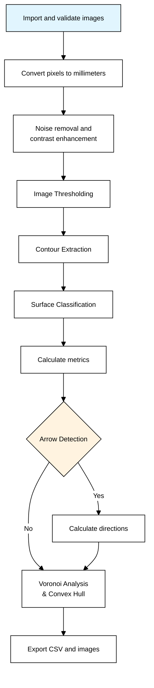

# Basic Usage

## Your First Run

After installing, the easiest starting point is to run the command on its own:

```bash
pylithics
```

This shows a **welcome splash** with the four most common command patterns. You can copy/paste whichever one you want from the panel. Running `pylithics` with no arguments only shows the splash and exits — it does not start a run.

The fastest way to confirm the analysis pipeline itself works is to copy the quick-start command from the splash and run it against the bundled sample data:

```bash
pylithics --data_dir pylithics/data --meta_file pylithics/data/meta_data.csv
```

This will:

1. Read metadata from `pylithics/data/meta_data.csv`
2. Load images from `pylithics/data/images/`
3. Load scales from `pylithics/data/scales/`
4. Process every image with the default settings
5. Write results to `pylithics/data/processed/`

When it finishes you should see a `processed_metrics.csv` file plus one `*_labeled.png` and one `*_voronoi.png` for each successfully processed image. To analyse *and* open the dashboard in one shot, add `--explore`:

```bash
pylithics --data_dir pylithics/data --meta_file pylithics/data/meta_data.csv --explore
```

### What you'll see on screen

PyLithics shows a live progress bar during batch processing plus one short summary line per image. The per-image suffix reflects how that image was calibrated:

- `awbari.png · 25.20 px/mm` — scale bar detected, real-world measurements.
- `image.png · pixels (no scale provided)` — pixel-only mode (no scale in metadata, or `--force_pixels`).
- `image.png · pixels (scale detection failed — see log)` — scale was provided but detection failed; the underlying reason is in `<data_dir>/processed/pylithics.log` as a `WARNING`.

At the end you get a single summary line — the exact log path PyLithics prints will be `<your --data_dir>/processed/pylithics.log`:

- All succeeded: `100/100 images processed without errors. Please check logs at <data_dir>/processed/pylithics.log`
- Some failed: `90/100 images processed successfully. Please check logs at <data_dir>/processed/pylithics.log for errors.`

The full per-step trace (every preprocessing step, every contour, every arrow assignment) **always lands in the log file** for reproducibility. If you want it on screen too, pass `--verbose` (or `-v`):

```bash
pylithics --data_dir ./data --meta_file ./meta.csv --verbose
```

## Command-Line Basics

### Required Arguments

Every PyLithics run requires these two arguments:

| Argument | Description | Example |
|----------|-------------|---------|
| `--data_dir` | Directory containing `images/` and `scales/` subdirectories | `pylithics/data` |
| `--meta_file` | Path to metadata CSV file | `pylithics/data/meta_data.csv` |

### Basic Command Structure

```bash
pylithics --data_dir <path> --meta_file <file> [options]
```

### Scale Calibration Examples

```bash
# Default: automatic scale-bar detection from images named in metadata
pylithics --data_dir ./data --meta_file ./metadata.csv

# Force pixel measurements (skip scale-bar detection entirely)
pylithics --data_dir ./data --meta_file ./metadata.csv --force_pixels

# Save scale-detection debug images for review
pylithics --data_dir ./data --meta_file ./metadata.csv --scale_debug

# Disable scale calibration and use pixel measurements
pylithics --data_dir ./data --meta_file ./metadata.csv --disable_scale_calibration
```

### DPI Processing Examples

```bash
# Default: fixed kernels optimized for archaeological line drawings
pylithics --data_dir ./data --meta_file ./metadata.csv

# Enable DPI-aware scaling for noisy photographs or degraded scans
pylithics --data_dir ./data --meta_file ./metadata.csv --enable_dpi_scaling

# Conservative scaling (minimal kernel adjustment)
pylithics --data_dir ./data --meta_file ./metadata.csv \
    --enable_dpi_scaling --dpi_scaling_mode conservative

# Aggressive scaling (maximum noise removal)
pylithics --data_dir ./data --meta_file ./metadata.csv \
    --enable_dpi_scaling --dpi_scaling_mode aggressive

# Custom DPI parameters
pylithics --data_dir ./data --meta_file ./metadata.csv \
    --enable_dpi_scaling --dpi_reference 150 --dpi_max_scale 2.0
```

### Module-Level Toggles

Several analysis modules can be turned off from the CLI:

```bash
# Skip arrow detection (faster runs, no flaking-direction output)
pylithics --data_dir ./data --meta_file ./metadata.csv --disable_arrow_detection

# Skip cortex detection (default sensitivity is "medium")
pylithics --data_dir ./data --meta_file ./metadata.csv --disable_cortex_detection

# Adjust cortex sensitivity instead of disabling
pylithics --data_dir ./data --meta_file ./metadata.csv --cortex_sensitivity high

# Skip scar adjacency analysis
pylithics --data_dir ./data --meta_file ./metadata.csv --disable_scar_complexity
```

Voronoi, symmetry, and lateral analysis are not disable-able from the CLI in this release; toggle them in `config.yaml` instead (see below).

### Also export per-lithic JSON

By default PyLithics writes a single `processed_metrics.csv`. Pass `--export_json` to additionally write one JSON file per lithic to `processed/json/`:

```bash
pylithics --data_dir ./data --meta_file ./metadata.csv --export_json
```

The CSV is unchanged. See [Outputs](outputs.md#per-lithic-json-output-optional) for the JSON schema.

### Launch the interactive dashboard

Pass `--explore` to open the [PyLithics Dashboard](dashboard.md) in your browser. With `--meta_file` it analyzes first then auto-opens against the new output; without it, `--data_dir` should point directly at the folder containing the `processed_metrics.csv` you want to explore (the folder name does not have to be `processed/` — it can be any folder, anywhere):

```bash
# Analyze and immediately explore.
# --data_dir is the project root (with images/, scales/); output is
# written to ./data/processed/ and the dashboard opens against it.
pylithics --data_dir ./data --meta_file ./metadata.csv --explore

# Re-open the dashboard later (no re-analysis).
# --data_dir is the actual folder containing processed_metrics.csv.
pylithics --data_dir ./data/processed --explore

# Explore a different run kept in its own folder.
pylithics --data_dir ./tanzania_run_2025 --explore
```

## Understanding the PyLithics Pipeline

When you run PyLithics, it processes each image through a fixed sequence of stages that extract contours, classify surfaces, calculate morphological metrics, and generate visualizations.

<div class="grid" markdown>

<div markdown>

### :material-chart-timeline: Processing Flow


```mermaid
%%{init: {'theme':'base', 'themeVariables': {'primaryColor': '#ffffff', 'primaryTextColor': '#000000', 'primaryBorderColor': '#000000', 'lineColor': '#000000', 'fontSize': '12px'}}}%%
flowchart TD
    A[Import and validate images] --> B[Convert pixels to millimeters]
    B --> C[Noise removal and<br/>contrast enhancement]
    C --> D[Image Thresholding]
    D --> E[Contour Extraction]
    E --> F[Surface Classification]
    F --> G[Calculate metrics]
    G --> H{Arrow Detection}
    H -->|Yes| I[Calculate directions]
    H -->|No| J[Voronoi Analysis<br/> & Convex Hull]
    I --> J[Voronoi Analysis<br/> & Convex Hull]
    J --> K[Export CSV and images]

    style A fill:#e1f5fe
    style H fill:#fff3e0
```

</div>

<div markdown>

### :material-information: Step Descriptions

**A. Import and validate images**
Load lithic illustrations and check file formats and resolution.

**B. Scale calibration & conversion**
Detect scale bars and compute a pixels-per-mm factor. Falls back to pixel measurements when no usable scale image is provided.

**C. Noise removal and contrast enhancement**
Clean scan artifacts and improve line definition.

**D. Image thresholding**
Convert to binary using simple, Otsu, or adaptive methods.

**E. Contour extraction**
Find object boundaries with a parent–child hierarchy (surfaces and scars).

**F. Surface classification**
Identify dorsal, ventral, platform, and lateral surfaces by relative size.

**G. Calculate metrics**
Measure dimensions, areas, aspect ratios, and shape properties.

**H. Arrow detection (optional)**
Find directional force indicators using DPI-aware computer vision.

**I. Calculate directions**
Determine flaking angles and associate arrows with specific scars.

**J. Voronoi analysis & convex hull**
Generate spatial-distribution patterns and convex-hull metrics.

**K. Export CSV and images**
Save measurement data and labeled visualization images.

</div>

</div>

## Configuration Options

### Configuration Hierarchy

PyLithics uses a three-layer configuration system:

1. **Default settings** — built into the code
2. **YAML configuration** — from a `config.yaml` file you provide via `--config_file`
3. **CLI overrides** — command-line arguments (highest priority)

A minimal custom config:

```yaml
# my_config.yaml
thresholding:
  method: otsu

arrow_detection:
  enabled: true

voronoi_analysis:
  enabled: true
  padding_factor: 0.05
```

Run with it:

```bash
pylithics --data_dir ./data --meta_file ./metadata.csv --config_file ./my_config.yaml
```

For the full list of CLI flags and config keys, see the [CLI Commands Reference](../reference/cli-commands.md).

## Next Steps

- [Understanding outputs](outputs.md) — interpret your results
- [CLI Commands Reference](../reference/cli-commands.md) — complete flag list
- [Voronoi analysis](voronoi-analysis.md) — spatial pattern analysis
- [Troubleshooting](troubleshooting.md) — solve common problems
