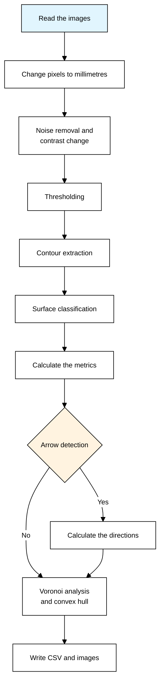

# Basic Usage

!!! danger "The project folder rule"
    `--data_dir` is a folder that contains these three items, with
    these exact names:

    ```
    <your folder>/
    ├── images/          the lithic images
    ├── scales/          the scale bar images
    └── meta_data.csv    which scale goes with which image
    ```

    The folder can have any name and can be anywhere. The three names
    inside it cannot change. PyLithics writes the analysis to a fourth
    item, `results/`, in the same folder.

## Your first analysis

After installation, type the command with no arguments:

```bash
pylithics
```

The command shows the **welcome screen** with the four most common
command patterns. Copy the command that you want. `pylithics` with no
arguments shows the screen and stops. It does not start an analysis.

To make sure that the pipeline operates, copy the quick-start command.
It analyses the sample data:

```bash
pylithics --data_dir pylithics/data
```

The command:

1. Reads the metadata from `pylithics/data/meta_data.csv`
2. Reads the images from `pylithics/data/images/`
3. Reads the scales from `pylithics/data/scales/`
4. Analyses each image with the default settings
5. Writes the results to `pylithics/data/results/`

`pylithics/data` is a **project folder**. Each project has the same
layout, and `--data_dir` is the only path that you type:

```
my_project/
├── images/          one image for each artefact
├── scales/          the scale bar images
├── meta_data.csv    connects each image to its scale
└── results/         the analysis (pylithics writes it)
```

If you start from published plates, `pylithics-pages` writes the first
three for you. See [Working from Published Plates](page-segmentation.md).

When the command stops, the output folder contains
`processed_metrics.csv`, and one `*_labeled.png` and one
`*_voronoi.png` for each image that was analysed. To analyse the images
and open the dashboard with one command, add `--explore`:

```bash
pylithics --data_dir pylithics/data --explore
```

### What the screen shows

PyLithics shows a progress bar during a batch, and one line for each
image. The end of the line shows the calibration of that image:

- `awbari.png · 25.20 px/mm` — a scale bar was found. The measurements are in millimetres.
- `image.png · pixels (no scale given)` — the measurements are in pixels. There is no scale in the metadata, or `--force_pixels` was used.
- `image.png · pixels (scale bar not found — see the log)` — a scale was given, but the scale bar was not found. The log gives the reason as a `WARNING`.

At the end, one summary line gives the log path. The path is
`<data_dir>/results/pylithics.log`:

- No errors: `100/100 images analysed with no errors. See the log at <data_dir>/results/pylithics.log`
- Some errors: `90/100 images analysed with no errors. See the log at <data_dir>/results/pylithics.log for the errors.`

The full trace (each preprocessing step, each contour, each arrow)
always goes to the log file. To show it on the screen, add `--verbose`
(or `-v`):

```bash
pylithics --data_dir ./data --verbose
```

## The command line

### Necessary arguments

| Argument | Description | Example |
|----------|-------------|---------|
| `--data_dir` | The project folder that contains `images/`, `scales/` and `meta_data.csv` | `pylithics/data` |
| `--meta_file` | A metadata CSV file with a different name or place. Default: `<data_dir>/meta_data.csv` | `./lyon_2024.csv` |

### Command structure

```bash
pylithics --data_dir <project> [options]
```

### Rows with no scale, and rows with a flag

A row with no `scale` value can only be measured in **pixels**. Before
the batch starts, the command counts those rows and asks once:

```
257 of 316 images have no scale value. Measure them in pixels? [y/N]
```

- `y`: all images are analysed. The images with no scale value are in
  pixels. Their screen line says so, and the CSV column
  `calibration_method` says `pixels`.
- `n`, or Enter: only the images with a scale value are analysed. The
  others are named in a count at the end. Fill in the scale and start
  the command again.

The command does not ask when no person can answer. In a script, a
pipe or a scheduled job, it prints the count as a warning and analyses
all images. It does not ask with `--force_pixels` or
`--disable_scale_calibration` either. Those mean pixels on purpose.

`meta_data.csv` can have a fourth column, `flag`. `pylithics-pages`
writes it. A flag does not stop the analysis. The row runs like any
other. At the end, one line gives the count for each flag:

```
45 row(s) in the metadata have a flag: no_scale 25, several_scales 20. The images were analysed. Examine each row in meta_data.csv.
```

The log lists each flagged row. See
[meta_data.csv](page-segmentation.md#meta_datacsv) for the flags.

### Scale calibration examples

```bash
# Default: find the scale bar in the scale image named in the metadata
pylithics --data_dir ./data

# Use pixel measurements. Do not look for a scale bar.
pylithics --data_dir ./data --force_pixels

# Write the scale detection debug images
pylithics --data_dir ./data --scale_debug

# Set scale calibration off. Use pixel measurements.
pylithics --data_dir ./data --disable_scale_calibration
```

### DPI examples

```bash
# Default: fixed kernels for archaeological line drawings
pylithics --data_dir ./data

# Set DPI scaling on, for photographs with noise or scans of low quality
pylithics --data_dir ./data --enable_dpi_scaling

# Conservative scaling: small kernel changes
pylithics --data_dir ./data \
    --enable_dpi_scaling --dpi_scaling_mode conservative

# Aggressive scaling: maximum noise removal
pylithics --data_dir ./data \
    --enable_dpi_scaling --dpi_scaling_mode aggressive

# Your own DPI parameters
pylithics --data_dir ./data \
    --enable_dpi_scaling --dpi_reference 150 --dpi_max_scale 2.0
```

### Module switches

You can set some analysis modules off from the command line:

```bash
# No arrow detection: faster, and no flaking-direction output
pylithics --data_dir ./data --disable_arrow_detection

# No cortex detection (the default sensitivity is "medium")
pylithics --data_dir ./data --disable_cortex_detection

# Change the cortex sensitivity
pylithics --data_dir ./data --cortex_sensitivity high

# No scar adjacency analysis
pylithics --data_dir ./data --disable_scar_complexity

# No morphological closing in the preprocessing
pylithics --data_dir ./data --closing False
```

`--closing` is `True` by default. It applies a small morphological
closing to the binary image. This closes gaps of one pixel in scanned
line art. Set it to `False` for clean digital line drawings. In those,
closing can join thin features.

Voronoi, symmetry and lateral analysis have no command-line switch in
this release. Set them in `config.yaml`.

### Parallel batches

PyLithics analyses a batch in parallel by default. Each image goes to a
worker process. The main process collects the CSV rows from the workers
and writes `processed_metrics.csv` when all workers stop.

```bash
# Default: automatic worker count (cpu_count - 1, maximum 8, maximum the batch size)
pylithics --data_dir ./data

# One worker: use this to find a problem with one image
pylithics --data_dir ./data --workers 1

# A given worker count
pylithics --data_dir ./data --workers 4
```

Sequential and parallel analyses give identical CSV and JSON output.
The decrease in time increases with the batch size. A batch of 5 images
shows a small difference. A batch of 100 images or more is
approximately N times faster on N cores.

### One JSON file for each lithic

By default PyLithics writes one `processed_metrics.csv`. Add
`--export_json` to also write one JSON file for each lithic to
`results/json/`:

```bash
pylithics --data_dir ./data --export_json
```

The CSV does not change. See [Outputs](outputs.md#one-json-file-for-each-lithic-optional)
for the JSON schema.

### The dashboard

Add `--explore` to open the [PyLithics Dashboard](dashboard.md) in
your browser. With `--data_dir`, the command does the analysis first
and then opens the dashboard for the new output. With a path,
`--explore` opens the dashboard for that folder and does no analysis.
The folder can have any name and can be in any place.

```bash
# Analyse and then open the dashboard.
# --data_dir is the project folder. The output goes to ./data/results/
# and the dashboard opens for it.
pylithics --data_dir ./data --explore

# Open the dashboard for a previous analysis. No new analysis.
# Give the folder that contains processed_metrics.csv.
pylithics --explore ./data/results

# Open the dashboard for an analysis in a different folder.
pylithics --explore ./tanzania_run_2025
```

## The pipeline

PyLithics does the same sequence of steps for each image. The steps
find the contours, classify the surfaces, calculate the metrics and
write the images.

<div class="grid" markdown>

<div markdown>

### :material-chart-timeline: Sequence


```mermaid
%%{init: {'theme':'base', 'themeVariables': {'primaryColor': '#ffffff', 'primaryTextColor': '#000000', 'primaryBorderColor': '#000000', 'lineColor': '#000000', 'fontSize': '12px'}}}%%
flowchart TD
    A[Read the images] --> B[Change pixels to millimetres]
    B --> C[Noise removal and<br/>contrast change]
    C --> D[Thresholding]
    D --> E[Contour extraction]
    E --> F[Surface classification]
    F --> G[Calculate the metrics]
    G --> H{Arrow detection}
    H -->|Yes| I[Calculate the directions]
    H -->|No| J[Voronoi analysis<br/> and convex hull]
    I --> J[Voronoi analysis<br/> and convex hull]
    J --> K[Write CSV and images]

    style A fill:#e1f5fe
    style H fill:#fff3e0
```

</div>

<div markdown>

### :material-information: Steps

**A. Read the images**
Read the illustrations. Make sure that the format and the resolution are correct.

**B. Scale calibration**
Find the scale bar and calculate the pixels for each millimetre. If there is no usable scale image, use pixel measurements.

**C. Noise removal and contrast change**
Remove scan noise and make the lines clearer.

**D. Thresholding**
Change the image to black and white with the simple, Otsu or adaptive method.

**E. Contour extraction**
Find the object boundaries as a parent–child hierarchy (surfaces and scars).

**F. Surface classification**
Identify the dorsal, ventral, platform and lateral surfaces by their relative size.

**G. Calculate the metrics**
Measure the dimensions, areas, aspect ratios and shape properties.

**H. Arrow detection (optional)**
Find the arrows that show the direction of force.

**I. Calculate the directions**
Calculate the flaking angles. Connect each arrow to its scar.

**J. Voronoi analysis and convex hull**
Calculate the spatial patterns and the convex-hull metrics.

**K. Write CSV and images**
Write the measurements and the labelled images.

</div>

</div>

## Configuration

### Three levels

PyLithics has three levels of configuration:

1. **Default settings** — in the code
2. **YAML configuration** — a `config.yaml` file that you give with `--config_file`
3. **Command-line arguments** — these replace the other two

A small configuration file:

```yaml
# my_config.yaml
thresholding:
  method: otsu

arrow_detection:
  enabled: true

voronoi_analysis:
  enabled: true
  padding_factor: 0.05
```

Use it:

```bash
pylithics --data_dir ./data --config_file ./my_config.yaml
```

For all flags and configuration keys, see the
[CLI Commands Reference](../reference/cli-commands.md).

## Next steps

- [Outputs](outputs.md) — read your results
- [CLI Commands Reference](../reference/cli-commands.md) — all flags
- [Voronoi analysis](voronoi-analysis.md) — spatial patterns
- [Troubleshooting](troubleshooting.md) — common problems
