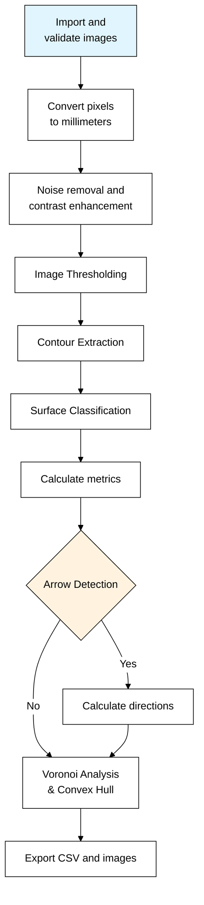

# Basic Usage

## Command Line Basics

### Required Arguments

Every PyLithics run requires these two arguments:

| Argument | Description | Example |
|----------|-------------|----------|
| `--data_dir` | Directory containing images and scales | `pylithics/data` |
| `--meta_file` | Path to metadata CSV file | `pylithics/data/meta_data.csv` |

### Basic Command Structure

Run PyLithics 'out of the box' with minimal configuration:

```bash
python pylithics/app.py --data_dir pylithics/data --meta_file pylithics/data/meta_data.csv
```
This command will:

1. Load images from `pylithics/data/images/`
2. Load scales from `pylithics/data/scales/`
3. Process according to default settings
4. Output results to `pylithics/data/processed/`

Choose your own paths for image and metadata directories:

```bash
python pylithics/app.py --data_dir <path> --meta_file <file> [options]
```

## Configuration Options

### Configuration Hierarchy

PyLithics uses a three-layer configuration system:

1. **Default settings** - Built into the code
2. **YAML configuration** - From config.yaml file
3. **CLI overrides** - Command-line arguments (highest priority)

For detailed configuration options, see the [CLI Commands Reference](../reference/cli-commands.md).

## Understanding the Processing Pipeline

<div class="grid" markdown>

<div markdown>

### :material-chart-timeline: Processing Flow



</div>

<div markdown>

### :material-information: Step Descriptions

**A. Import and validate images**
Load lithic illustrations and verify file formats, DPI consistency

**B. Convert pixels to millimeters**
Apply scale references from metadata CSV for real-world measurements

**C. Noise removal and contrast enhancement**
Clean up scan artifacts and improve line definition

**D. Image Thresholding**
Convert to binary (black/white) using simple, Otsu, or adaptive methods

**E. Contour Extraction**
Find object boundaries with parent-child hierarchy (surfaces and scars)

**F. Surface Classification**
Identify dorsal, ventral, platform, and lateral surfaces by size and position

**G. Calculate metrics**
Measure dimensions, areas, aspect ratios, and shape properties

**H. Arrow Detection (Optional)**
Find directional force indicators using DPI-aware computer vision

**I. Calculate directions**
Determine flaking angles and associate arrows with specific scars

**J. Voronoi Analysis & Convex Hull**
Generate spatial distribution patterns and calculate convex properties

**K. Export CSV and images**
Save measurements data and labeled visualization images

</div>

</div>

## Quick Examples

### Basic Analysis
```bash
# Simple processing with default settings
python pylithics/app.py --data_dir pylithics/data --meta_file pylithics/data/meta_data.csv
```

### With Debugging
```bash
# Enable debug output and arrow detection debugging
python pylithics/app.py --data_dir pylithics/data --meta_file pylithics/data/meta_data.csv \
         --log_level DEBUG --arrow_debug
```

### Fast Processing
```bash
# Disable time-consuming features for speed
python pylithics/app.py --data_dir pylithics/data --meta_file pylithics/data/meta_data.csv \
         --disable_arrow_detection --disable_voronoi
```

## Output Metrics

PyLithics calculates these essential metrics:

### Basic Measurements
- `technical_length`: Platform to distal distance (mm)
- `technical_width`: Maximum perpendicular width (mm)
- `area`: Surface area (mm²)
- `perimeter`: Boundary length (mm)
- `aspect_ratio`: Length/width ratio

### Shape Metrics
- `circularity`: Shape compactness (0-1)
- `convexity`: Convex hull ratio
- `solidity`: Area/convex hull area

### Advanced Analysis (when enabled)
- `symmetry_vertical`: Vertical balance (0-1)
- `symmetry_horizontal`: Horizontal balance (0-1)
- `scar_count`: Number of dorsal scars
- `scar_complexity`: Adjacency relationships
- `has_arrow`: Arrow detection flag
- `arrow_angle`: Flaking direction (degrees)

## Monitoring Progress

PyLithics provides progress feedback:

```
[INFO] Loading images from pylithics/data/images/
[INFO] Found 25 images to process
[INFO] Processing artifact_001.png...
[INFO] - Extracted 12 contours
[INFO] - Classified: Dorsal, Ventral surfaces
[INFO] - Detected 3 arrows
[INFO] Processing artifact_002.png...
```

## Next Steps

- [Understanding outputs](outputs.md) - Interpret your results
- [CLI Commands Reference](../reference/cli-commands.md) - Complete command list
- [Voronoi analysis](voronoi-analysis.md) - Spatial pattern analysis
- [Troubleshooting](troubleshooting.md) - Solve common problems