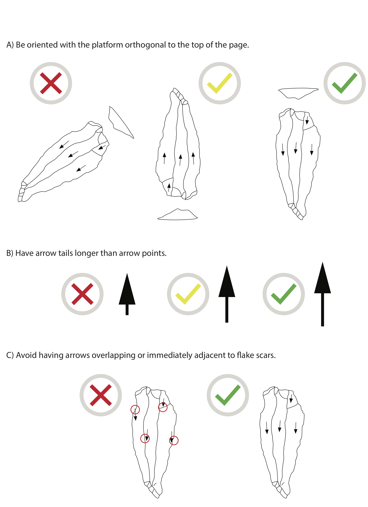
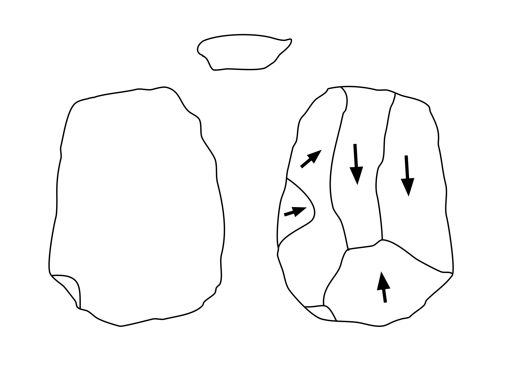
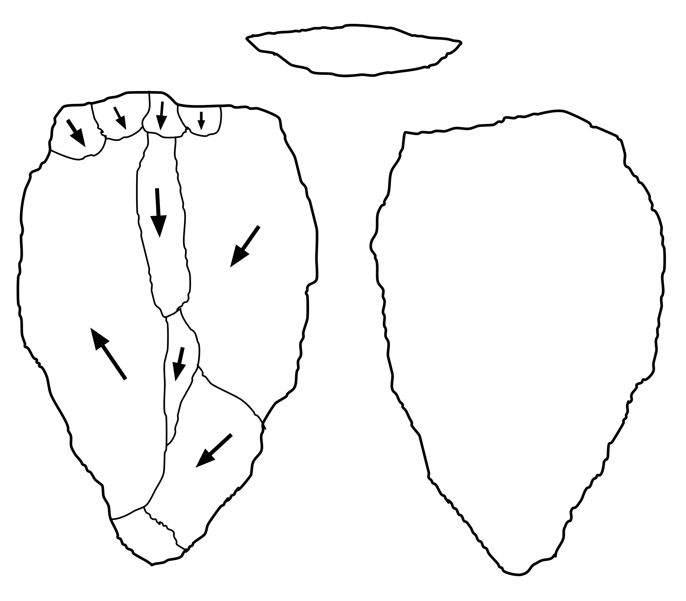
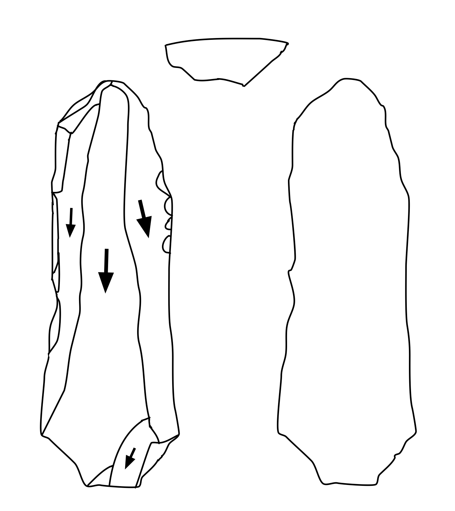
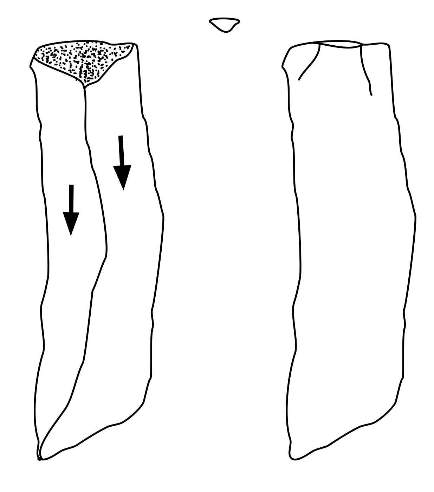
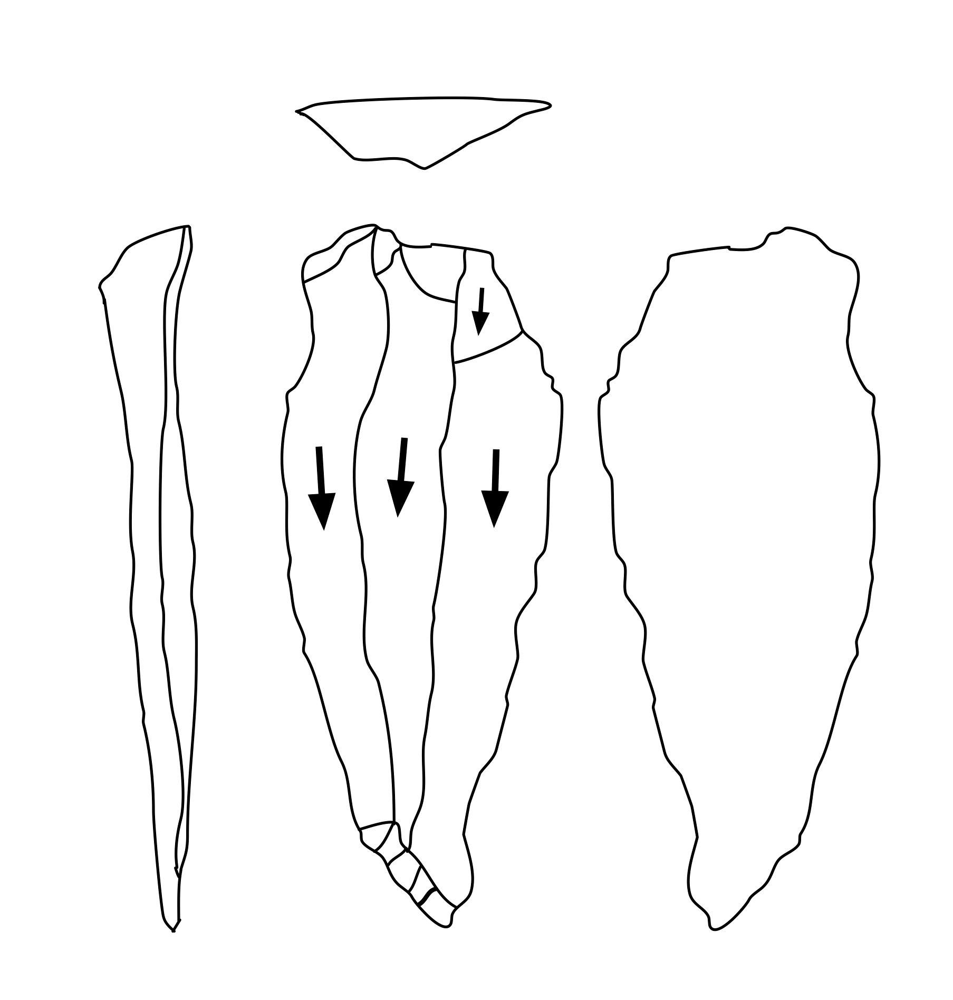

# Image Requirements

## Overview

PyLithics works with scanned illustrations of 2D lithic artifacts commonly found in archaeological publications. Understanding the image requirements and drawing conventions will help you achieve the best results.

## Supported File Formats

### Accepted Formats
- **PNG** (recommended): Lossless compression, best for line drawings
- **JPG/JPEG**: Widely supported, though compression may affect quality
- **TIFF**: High quality, larger file sizes

### Resolution Requirements
- **Optimal**: 300 DPI (dots per inch) for best results
- **Supported Range**: PyLithcis has been tested between 75 DPI (minimum) to 600 DPI (maximum)
- **Recommended**: 300 DPI provides the best balance of quality and processing speed

!!! tip "Automatic DPI Detection"
    PyLithics automatically reads DPI information from your image files and adjusts detection algorithms accordingly. You don't need to manually specify DPI - it's extracted from the image metadata. Higher resolution improves arrow and small feature detection.

## Drawing Style Guidelines

### Optimal Drawing Characteristics

PyLithics performs best with:
- **Clean line drawings**: Black lines on white background
- **Clear contrast**: Strong black/white separation
- **Minimal artifacts**: No scanning artifacts or shadows
- **Complete outlines**: Closed contours for surfaces

### Supported Illustration Conventions
Currently, PyLithics is optimized to work with flakes.

#### Surface Representations
- **Dorsal surface**: Primary view with scar patterns
- **Ventral surface**: Smooth surface view (if present)
- **Platform**: Striking platform view (if present)
- **Lateral edges**: Side profile views (if present)

#### Internal Details
- **Flake scars**: Clear outline definition
- **Cortex areas**: Stippling or distinct shading patterns
- **Arrows**: Direction indicators for flaking
- **Ripple marks**: Concentric lines showing force propagation

## Orientation Requirements

### Standard Archaeological Convention

PyLithics is designed to work with lithic illustrations that follow established archaeological drawing conventions. Lithic illustrators have standardized systems of artifact orientation and proportions that are essential for accurate analysis.

**Key orientation principles:**

1. **Vertical Axis**: Perpendicular (orthogonal) to the striking platform
2. **Scale**: Lithics are normally drawn at 1:1 scale
3. **Primary View**: Usually the dorsal surface is the principal view
4. **Multiple Views**: Adjacent surfaces illustrated at 90-degree rotations from the principal view
5. **Consistent Orientation**: All views maintain the same relative positioning

!!! important "Critical for Accuracy"
    The vertical axis must be orthogonal to the striking platform. This standardization is crucial for accurate measurements, surface classification, and comparative analysis.

### Visual Example

For best performance and accurate measurement, images loaded into PyLithics should:

*Example of optimal drawing style and orientation for PyLithics analysis*

### Common Issues to Avoid

❌ **Poor Quality**:

- Blurry or low-resolution scans
- Gray or faded lines
- Incomplete contours
- Mixed drawing styles

✅ **Good Quality**:

- Sharp, clear lines
- High contrast
- Complete outlines
- Consistent style

## Example Images

PyLithics comes with five sample images for you to experiment with. These images have the following characteristics that work best for PyLithics:

- Clean black lines on white background
- Closed contours for all surfaces
- Clear scar definitions
- Consistent line thickness
- Arrows for flaking direction (optional)

{ width="18%" } { width="18%" } { width="18%" } { width="18%" } { width="18%" }

## What about ripples?

### The Challenge with Ripple Marks

While ripple marks (concentric curved lines) are a traditional way to indicate flaking direction in archaeological illustrations, they present challenges for PyLithics' computer vision algorithms:

**Issues with ripples:**

- **Detection difficulty**: Ripple marks can be mistaken for scar boundaries or surface features
- **Inconsistent representation**: Different illustrators draw ripples with varying styles and densities
- **Ambiguous direction**: Multiple concentric lines can create uncertainty about the exact force direction
- **Processing interference**: Ripples can interfere with accurate contour detection and surface classification

**Why arrows work better:**

- **Clear directionality**: Arrows provide unambiguous force direction indication
- **Consistent detection**: PyLithics is specifically optimized for arrow recognition
- **Clean contours**: Arrows don't interfere with surface and scar boundary detection
- **Precise analysis**: Enable accurate flaking angle measurements and technological analysis

### Solution: Lithic Editor and Annotator

For illustrations with ripple marks, we recommend using the [**Lithic Editor and Annotator**](https://github.com/JasonGellis/lithic-editor) tool to:

1. **Remove ripple marks** cleanly without affecting scar boundaries
2. **Replace with arrows** that indicate the same directional information
3. **Optimize for PyLithics** analysis with clean, arrow-based illustrations

### Before and After Examples

The following examples show how Lithic Editor and Annotator can transform ripple-based illustrations into PyLithics-optimized versions:

{ width="30%" } { width="30%" } { width="30%" }

*Example workflow: Original illustration with ripples → Ripples removed → Arrows added for optimal PyLithics analysis*

!!! tip "Lithic Editor Integration"
    The Lithic Editor and Annotator tool is designed specifically to prepare archaeological illustrations for PyLithics analysis. It preserves all morphological information while optimizing directional indicators for computer vision processing.

## Preparing Your Dataset

### Step-by-Step Checklist

1. ☐ Scan at 300 DPI minimum
2. ☐ Save as PNG or high-quality JPG
3. ☐ Ensure consistent orientation
4. ☐ Include scale reference
5. ☐ Clean up scan artifacts
6. ☐ Verify contrast levels
7. ☐ Organize in proper directory structure
8. ☐ Create metadata CSV

## Next Steps

Once your images meet these requirements:
1. [Set up your metadata file](metadata-setup.md)
2. [Configure PyLithics settings](basic-usage.md)
3. [Run your analysis](basic-usage.md#running-your-first-analysis)