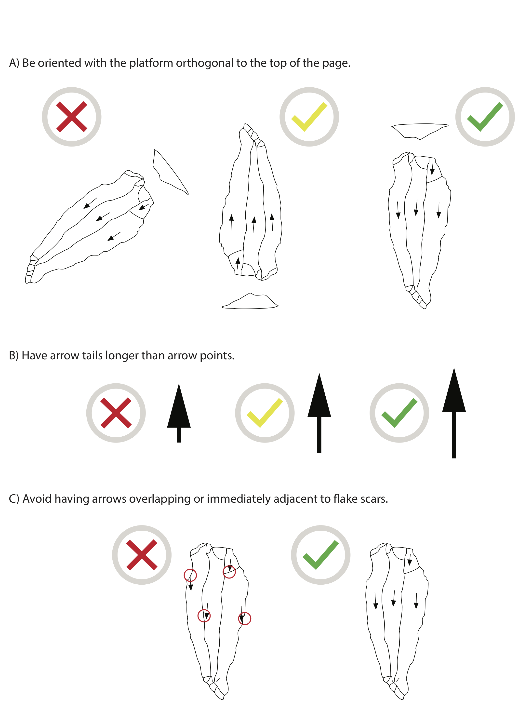
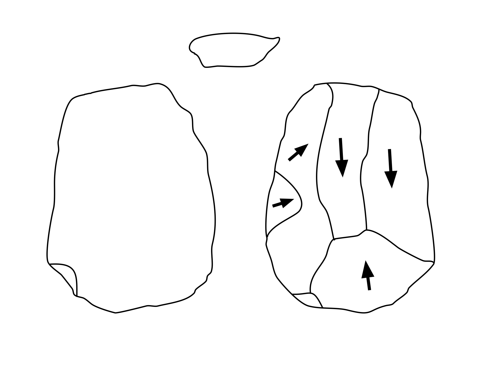
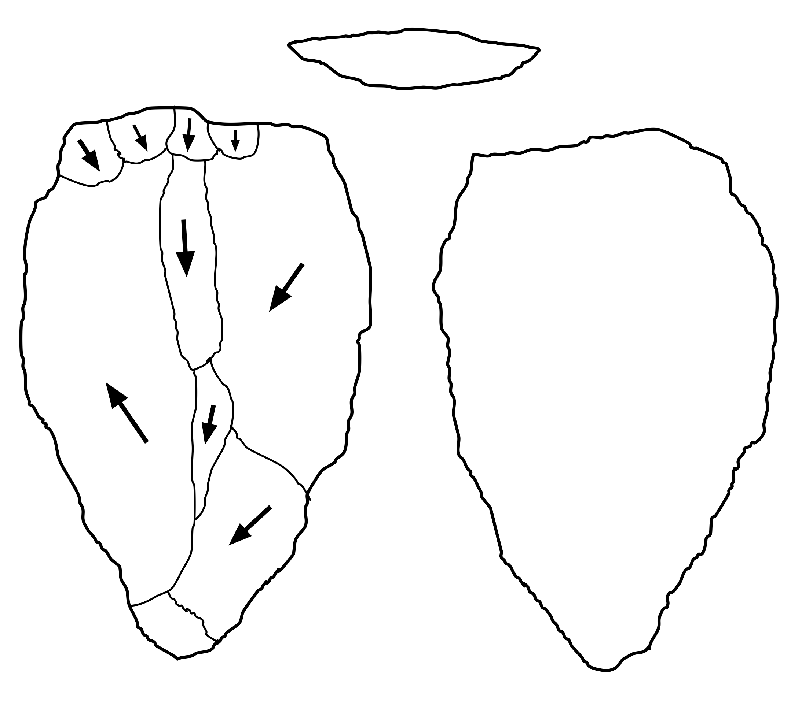
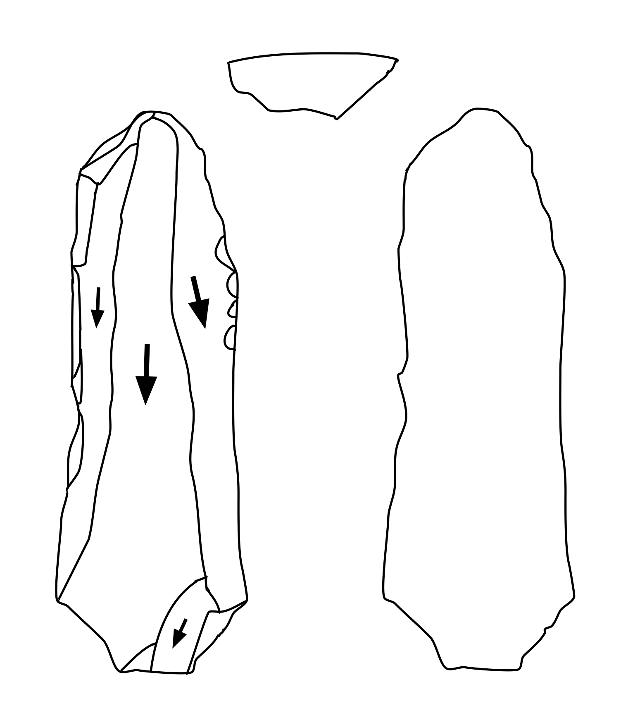
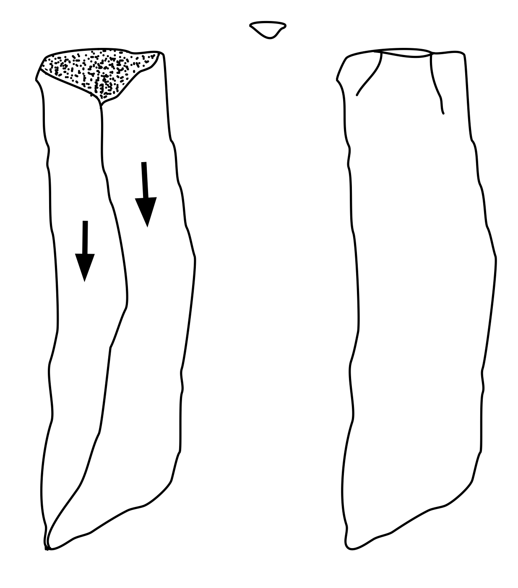
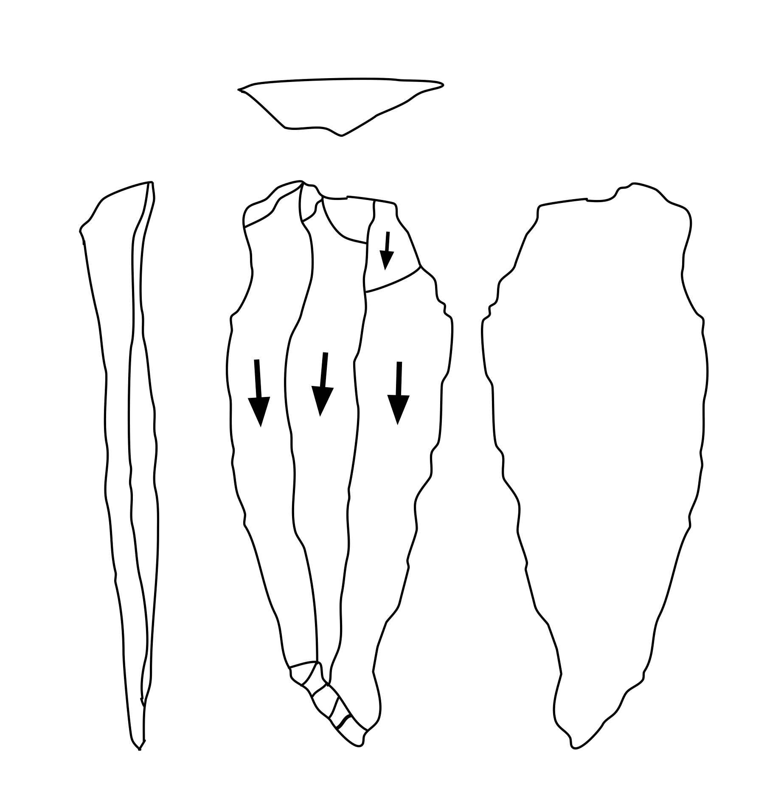
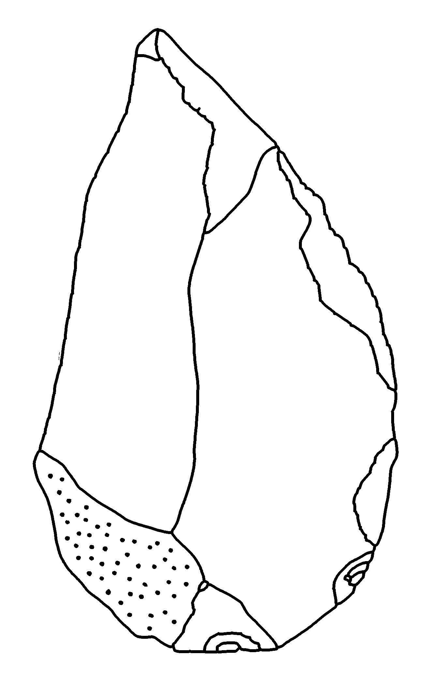
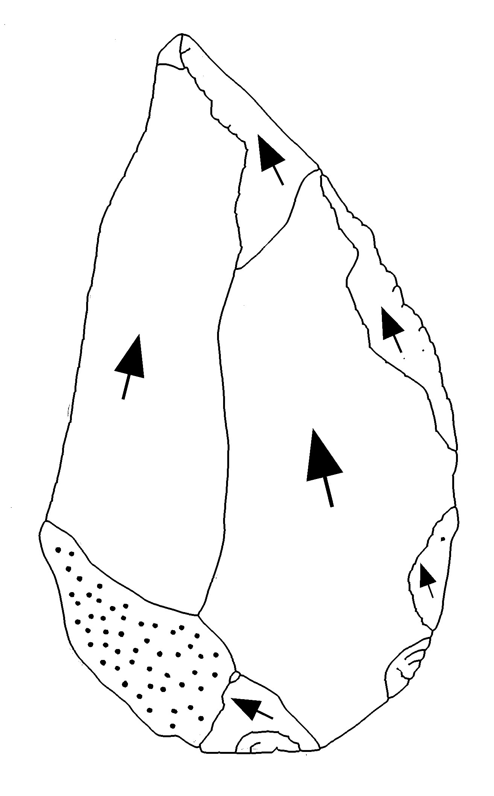

# Prepare Your Images

## Overview

PyLithics reads scanned illustrations of 2D lithic artefacts, of the
type in archaeological publications. This page gives the image
specifications and the drawing conventions that give the best results.

## File formats

### Formats
- **PNG** (recommended): no loss of data. The best format for line drawings.
- **JPG/JPEG**: many programs write it. The compression can decrease the quality.
- **TIFF**: high quality. The files are large.

### Resolution
- **Best**: 300 DPI. This is the best balance of quality and speed.
- **Tested**: PyLithics is tested from 75 DPI to 600 DPI.
- **High resolution**: 600 DPI or more operates well for line drawings with the default settings.
- **Recommended**: 300–600 DPI for archaeological illustrations.

!!! tip "DPI"
    PyLithics reads the DPI from your image files. For line drawings,
    the default fixed kernels operate well from 75 to 600 DPI.
    DPI-aware scaling is available. It is usually not necessary for
    clean line art. It is for photographs with noise and for scans of
    low quality.

### DPI modes

**Default mode (recommended for line drawings)**

- Fixed kernel sizes, set for line drawings
- The same result from 75 to 600 DPI
- Keeps small scar details at high resolution
- No DPI scaling

**DPI-aware mode (for images with noise)**

- Set it on with `--enable_dpi_scaling`
- The kernel sizes change with the DPI of the image
- For scans of low quality, and for images with noise
- Three modes: conservative, standard, aggressive

## Drawing style

### The best drawings

PyLithics gives the best results with:

- **Clean line drawings**: black lines on a white background
- **High contrast**: clear black and white
- **No noise**: no scan marks and no shadows
- **Closed outlines**: each surface has a closed contour

### Illustration conventions

PyLithics is set for flakes.

#### Surfaces
- **Dorsal surface**: the main view, with the scars
- **Ventral surface**: the smooth surface (if present)
- **Platform**: the striking platform (if present)
- **Lateral edges**: the side views (if present)

#### Details
- **Flake scars**: clear outlines
- **Cortex**: stipple, or a different fill pattern
- **Arrows**: the direction of the flaking
- **Ripple marks**: curved lines that show the direction of the force

## Orientation

### The archaeological convention

PyLithics reads lithic illustrations that follow the archaeological
drawing conventions. Illustrators use standard systems of orientation
and proportion. These are necessary for an accurate analysis.

**The orientation rules:**

1. **Vertical axis**: perpendicular to the striking platform
2. **Scale**: lithics are usually drawn at 1:1
3. **Main view**: usually the dorsal surface
4. **Other views**: the adjacent surfaces, turned 90 degrees from the main view
5. **Same orientation**: all views keep the same relative position

!!! important "Necessary for accuracy"
    The vertical axis must be perpendicular to the striking platform.
    This is necessary for accurate measurements, surface classification
    and comparison.

### Example

For the best results, the images must be like this:

*An example of the best drawing style and orientation for PyLithics*

### Problems to prevent

❌ **Low quality**:

- Scans that are not sharp, or have a low resolution
- Grey or faint lines
- Contours that are not complete
- Different drawing styles in one image

✅ **Good quality**:

- Sharp, clear lines
- High contrast
- Complete outlines
- One style

## Example images

PyLithics has five sample images. They have these properties, which
give the best results:

- Clean black lines on a white background
- Closed contours for all surfaces
- Clear scars
- The same line thickness
- Arrows for the flaking direction (optional)

{ width="18%" } { width="18%" } { width="18%" } { width="18%" } { width="18%" }

## Ripple marks

### The problem with ripple marks

Ripple marks (curved lines, one inside the other) are the usual way to
show the flaking direction in archaeological illustrations. They are a
problem for the PyLithics computer vision:

- **Detection**: PyLithics can read a ripple mark as a scar boundary or a surface feature
- **Style**: illustrators draw ripple marks in different styles and densities
- **Direction**: many curved lines do not give one clear direction of force
- **Contours**: ripple marks can prevent correct contour detection and surface classification

**Why arrows are better:**

- **Direction**: an arrow gives one clear direction of force
- **Detection**: PyLithics is set for arrows
- **Contours**: arrows do not prevent the detection of surface and scar boundaries
- **Measurement**: arrows let PyLithics measure the flaking angle

### The Lithic Editor and Annotator

For illustrations with ripple marks, use the [**Lithic Editor and
Annotator**](https://github.com/JasonGellis/lithic-editor) to:

1. **Remove the ripple marks** without a change to the scar boundaries
2. **Add arrows** that give the same direction
3. **Prepare the illustration for PyLithics**

### Before and after

These examples show an illustration with ripple marks, the same
illustration without them, and the same illustration with arrows:

{ width="30%" } { width="30%" } { width="30%" }

*The illustration with ripple marks → without ripple marks → with arrows*

!!! tip "Lithic Editor"
    The Lithic Editor and Annotator prepares archaeological
    illustrations for PyLithics. It keeps all the morphological
    information. It changes only the direction marks.

## Prepare your data set

### Checklist

1. ☐ Scan at 300 DPI or more
2. ☐ Keep the images as PNG, or as JPG of high quality
3. ☐ Make sure that the orientation is the same in all images
4. ☐ Include a scale
5. ☐ Remove scan marks
6. ☐ Make sure that the contrast is high
7. ☐ Put the files in the correct directory structure
8. ☐ Write the metadata CSV file

## Next steps

When your images are correct:

1. [Prepare the metadata file](metadata-setup.md)
2. [Set the PyLithics configuration](basic-usage.md)
3. [Start the analysis](basic-usage.md#the-command-line)
