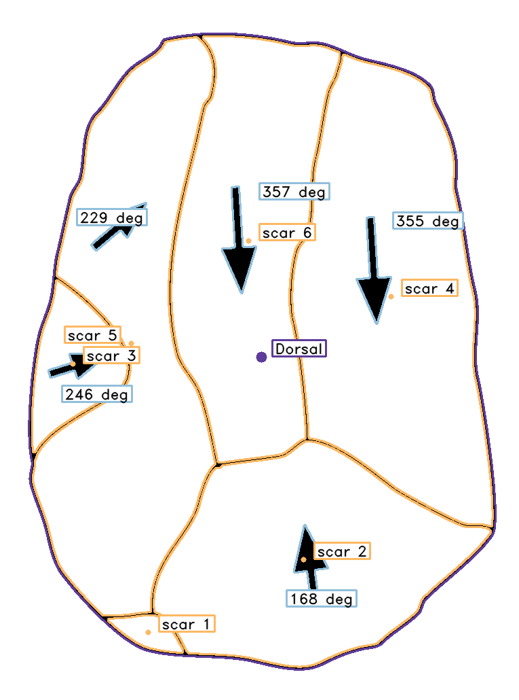
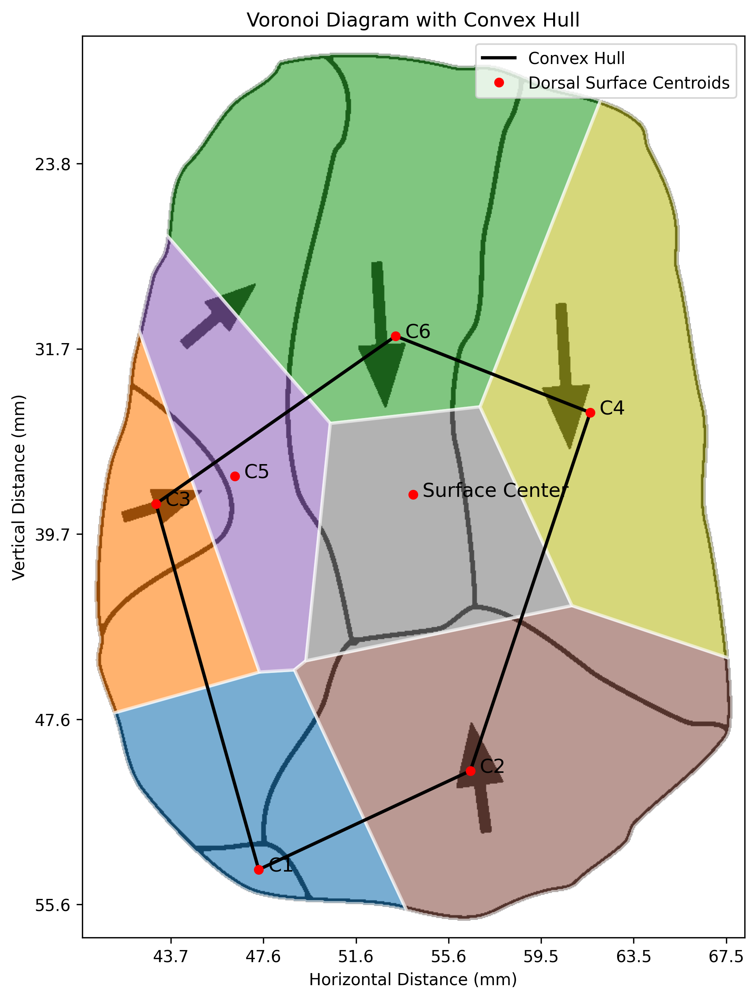

# PyLithics Outputs

## Overview

PyLithics generates multiple types of output files to help you analyze and validate your results. This page describes all the files created during processing and how to interpret them.

## Output Directory Structure

After running PyLithics, your output directory will contain:

```
processed/
├── processed_metrics.csv              # Main data output
├── pylithics.log                      # Processing log
├── artifact_001.png_labeled.png       # Annotated visualizations
├── artifact_001.png_voronoi.png
├── artifact_002.png_labeled.png
└── artifact_002.png_voronoi.png
```

## Primary Data Output

### processed_metrics.csv

The main output file containing all quantitative measurements in CSV format.

#### Data Structure

The CSV is hierarchically organized:
- **Surfaces**: Dorsal, Ventral, Platform, Lateral
- **Features**: Individual scars and cortex areas

#### Key Columns

**Identification**
- `image_id`: Source image filename
- `surface_type`: Dorsal, Ventral, Platform, Lateral
- `surface_feature`: Surface name (e.g., "Dorsal", "scar 1", "cortex")
- `total_dorsal_scars`: Count of scars on dorsal surface

**Scale Calibration Metadata**
- `calibration_method`: Method used ("scale_bar" or "pixels")
- `pixels_per_mm`: Conversion factor applied
- `scale_confidence`: Detection confidence score (0-1)

**Position and Dimensions**

- `technical_width`: Maximum perpendicular width (mm)
- `technical_length`: Platform-to-distal distance (mm)
- `max_width`, `max_length`: Maximum dimensions (mm)
- `total_area`: Surface area (mm²)
- `perimeter`: Boundary perimeter (mm)
- `centroid_x`, `centroid_y`: Center coordinates of surfaces and scars (mm)

**Shape Properties**
- `aspect_ratio`: Length/width ratio
- `distance_to_max_width`: Distance from platform to maximum width

**Spatial Analysis**
- `top_area`, `bottom_area`, `left_area`, `right_area`: Quadrant areas (mm²)
- `voronoi_num_cells`: Number of Voronoi cells
- `voronoi_cell_area`: Individual cell area (mm²)
- `convex_hull_width`, `convex_hull_height`: Convex hull dimensions (mm)
- `convex_hull_area`: Convex hull area (mm²)

**Symmetry Analysis**
- `vertical_symmetry`: Vertical balance (0-1)
- `horizontal_symmetry`: Horizontal balance (0-1)

**Feature Detection**
- `lateral_convexity`: Edge convexity measure
- `is_cortex`: Cortex detection flag (true/false)
- `cortex_area`: Cortex area (mm²)
- `cortex_percentage`: Percentage of surface with cortex
- `scar_complexity`: Adjacency relationships count
- `has_arrow`: Arrow detection flag (true/false)
- `arrow_angle`: Flaking direction (degrees)

## Visualization Outputs

### Labeled Images

**Filename pattern**: `{image_id}_labeled.png`

**Content**:

<div class="grid cards" markdown>

<div markdown>

- Original image with colored overlays
- Contour boundaries in different colors
- Surface classifications as labels
- Arrow indicators (if detected)

**Color Coding**:

- **<span style="color: rgb(94, 60, 153)">Purple</span>**: Surface identification (dorsal/ventral/platform/lateral)
- **<span style="color: rgb(253, 184, 99)">Orange</span>**: Scar elements
- **<span style="color: rgb(215, 48, 39)">Red</span>**: Cortex elements
- **<span style="color: rgb(128, 205, 193)">Mint Green</span>**: Lateral edges
- **<span style="color: rgb(178, 171, 210)">Light Purple</span>**: Platform marks
- **<span style="color: rgb(145, 191, 219)">Light Blue</span>**: Arrows

</div>

<div markdown>

{ width="300px" }

*Example of labeled image output showing surface classification, scar detection, and color-coded features*

</div>

</div>

### Voronoi Diagrams With Convex Hull

**Filename pattern**: `{image_id}_voronoi.png`

**Content**:

<div class="grid cards" markdown>

<div markdown>

- Spatial tessellation of scar centroids
- Voronoi cell boundaries and areas
- Convex hull outline of all centroids
- Cell area colorization
- Statistical overlays
- Axes in millimeters (when scale calibration available) or pixels (fallback)

**Interpretation**:

- Dense patterns indicate intensive flaking
- Large cells suggest sparse scar distribution
- Regular patterns may indicate systematic reduction

</div>

<div markdown>

{ width="300px" }

*Example of Voronoi diagram with convex hull showing spatial distribution of dorsal surface centroids*

</div>

</div>

## Processing Log

**Filename**: `pylithics.log`

**Content**:
- Processing timestamps
- Configuration settings used
- Error messages and warnings
- Performance metrics
- Feature detection statistics

**Example log entries**:
```
2024-01-15 10:30:15 [INFO] Starting PyLithics analysis
2024-01-15 10:30:15 [INFO] Configuration: arrow_detection=True, scale_calibration=True, voronoi=True
2024-01-15 10:30:16 [INFO] Processing artifact_001.png
2024-01-15 10:30:16 [INFO] Scale bar detected: 1260 pixels, confidence: 0.95, dimensions: 1260x34
2024-01-15 10:30:16 [INFO] Using scale bar calibration: 25.2 pixels/mm (1260 pixels = 50 mm)
2024-01-15 10:30:16 [INFO] - Found 15 contours
2024-01-15 10:30:16 [INFO] - Classified: Dorsal (1), Ventral (1) surfaces
2024-01-15 10:30:16 [INFO] - Detected 3 arrows
2024-01-15 10:30:16 [WARNING] - Low contrast in ventral surface
2024-01-15 10:30:16 [INFO] Converted measurements to millimeters using factor: 25.200
2024-01-15 10:30:17 [INFO] Processing artifact_002.png
2024-01-15 10:30:17 [INFO] No scale calibration available, measurements will be in pixels
2024-01-15 10:30:17 [INFO] Processing complete: 2.1 seconds
```

## Output Validation

### Visual Validation

1. **Check labeled images**: Verify contour detection accuracy
2. **Review classifications**: Ensure surfaces are correctly identified
3. **Validate arrows**: Confirm arrow detection and directions
4. **Assess completeness**: Check for missed features

### Data Validation

1. **Measurement ranges**: Verify values are reasonable
2. **Unit consistency**: Ensure mm units throughout
3. **Missing data**: Check for incomplete records
4. **Outlier detection**: Identify unusual measurements


## Working with Output Data

### Loading in R

```r
# Load and explore data
data <- read.csv("processed/processed_metrics.csv")

# Surface summary
table(data$surface_type)

# Basic statistics
summary(data[c("technical_length", "technical_width", "area")])

# Plot length vs width
plot(data$technical_length, data$technical_width,
     xlab="Length (mm)", ylab="Width (mm)",
     col=as.factor(data$surface_type))
```

### Loading in Python

```python
import pandas as pd
import matplotlib.pyplot as plt

# Load data
df = pd.read_csv('processed/processed_metrics.csv')

# Filter for surfaces only
surfaces = df[df['surface_feature'] == 'Surface']

# Basic plotting
plt.figure(figsize=(10, 6))
plt.scatter(surfaces['technical_length'], surfaces['technical_width'],
           c=surfaces['surface_type'].astype('category').cat.codes)
plt.xlabel('Length (mm)')
plt.ylabel('Width (mm)')
plt.title('Lithic Dimensions by Surface Type')
plt.show()
```

## Next Steps

- [Glossary](glossary.md) - Reference for all metrics