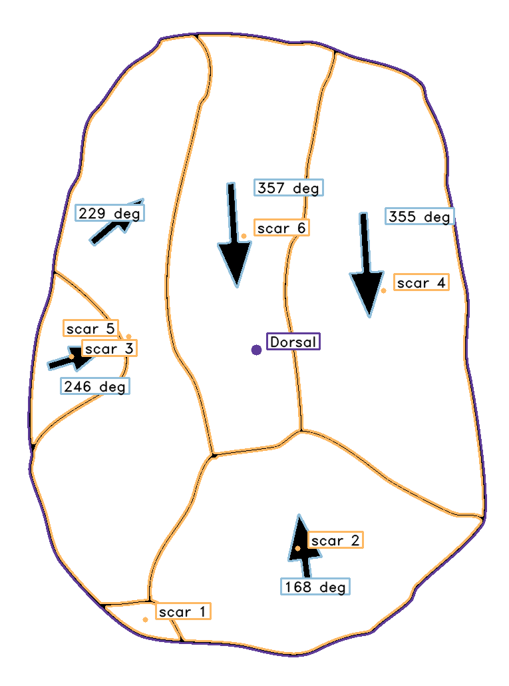
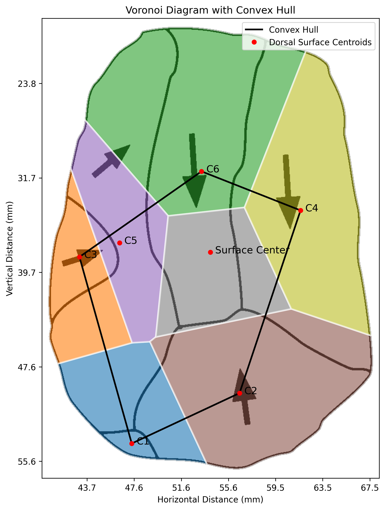

# PyLithics Outputs

## Overview

PyLithics writes everything it produces into a single `processed/` directory under your `--data_dir`. This page describes each output file and how to read it.

## Output Directory Structure

After a successful run:

```
processed/
├── processed_metrics.csv          # Combined metrics for every image
├── pylithics.log                  # Processing log
├── artifact_001_labeled.png       # Annotated visualization
├── artifact_001_voronoi.png       # Voronoi diagram (Dorsal surfaces only)
├── artifact_002_labeled.png
├── artifact_002_voronoi.png
└── json/                          # Only when --export_json is used
    ├── artifact_001.json
    └── artifact_002.json
```

## Primary Data Output: `processed_metrics.csv`

The single CSV holds one row per detected surface or scar across all images you processed. The schema below lists every column that PyLithics writes; missing values appear as `NA`.

### Identification Columns

| Column | Description |
|--------|-------------|
| `image_id` | Source image filename |
| `surface_type` | `Dorsal`, `Ventral`, `Platform`, `Lateral`, or `Unclassified` |
| `surface_feature` | Surface name when the row is a parent (e.g. `Dorsal`); scar/edge/cortex label when the row is a child (e.g. `scar 1`, `edge 2`, `cortex 1`) |
| `total_dorsal_scars` | Count of scars on the dorsal surface (filled only on the Dorsal parent row) |

### Position and Dimensions

| Column | Units | Description |
|--------|-------|-------------|
| `centroid_x` | mm or px | X-coordinate of the contour centroid |
| `centroid_y` | mm or px | Y-coordinate of the contour centroid |
| `technical_width` | mm or px | Maximum perpendicular width (parent surfaces only) |
| `technical_length` | mm or px | Platform-to-distal distance (parent surfaces only) |
| `max_width` | mm or px | Maximum dimension perpendicular to `max_length` |
| `max_length` | mm or px | Longest dimension regardless of orientation |
| `total_area` | mm² or px² | Area enclosed by the contour |
| `perimeter` | mm or px | Boundary perimeter |
| `aspect_ratio` | ratio | `technical_length` / `technical_width` |
| `distance_to_max_width` | mm or px | Distance from the platform to the point of maximum width |

Units are millimetres when scale calibration succeeds and pixels otherwise. Check the `calibration_method` column to confirm.

### Voronoi & Convex Hull (Dorsal parent row only)

| Column | Units | Description |
|--------|-------|-------------|
| `voronoi_num_cells` | count | Number of Voronoi cells over the dorsal scars |
| `voronoi_cell_area` | mm² or px² | Area of the Voronoi cell containing this row's centroid |
| `convex_hull_width` | mm or px | Width of the convex hull around scar centroids |
| `convex_hull_height` | mm or px | Height of the convex hull |
| `convex_hull_area` | mm² or px² | Area of the convex hull |

### Symmetry (Dorsal parent row only)

| Column | Units | Description |
|--------|-------|-------------|
| `top_area` | mm² or px² | Filled-pixel area above the centroid |
| `bottom_area` | mm² or px² | Filled-pixel area below the centroid |
| `left_area` | mm² or px² | Filled-pixel area left of the centroid |
| `right_area` | mm² or px² | Filled-pixel area right of the centroid |
| `vertical_symmetry` | 0–1 | `1 − \|top − bottom\| / (top + bottom)` |
| `horizontal_symmetry` | 0–1 | `1 − \|left − right\| / (left + right)` |

### Lateral Edge

| Column | Units | Description |
|--------|-------|-------------|
| `lateral_convexity` | 0–1 | Lateral surface area / convex hull area |

### Cortex

| Column | Units | Description |
|--------|-------|-------------|
| `is_cortex` | bool | `True` for child rows reclassified as cortex |
| `cortex_area` | mm² or px² | Area of the cortex region |
| `cortex_percentage` | 0–100 | Cortex area as percentage of parent surface |

### Arrows

| Column | Units | Description |
|--------|-------|-------------|
| `has_arrow` | bool | `True` if a directional arrow was detected |
| `arrow_angle` | degrees | Compass-style angle in PyLithics's rotated frame; see note below |

!!! note "Arrow Angle Convention"
    `arrow_angle` is in a 0–360° compass-style frame, but rotated relative to standard cardinal compass headings: a downward-pointing arrow in image coordinates maps to `0`, and a rightward-pointing arrow maps to `270`. Treat `arrow_angle` as a relative value when comparing scars within the same image.

### Scar Complexity

| Column | Units | Description |
|--------|-------|-------------|
| `scar_complexity` | count | Number of other dorsal scars within the configured adjacency distance |

### Scale Calibration Metadata

These columns are added when scale-bar calibration was attempted:

| Column | Description |
|--------|-------------|
| `calibration_method` | `scale_bar` (real-world units) or `pixels` (no calibration) |
| `pixels_per_mm` | Conversion factor applied (omitted when calibration failed) |
| `scale_confidence` | Detection confidence (0–1) for scale-bar measurement |

### Optional Arrow Geometry

These columns appear only when arrow detection ran and produced detailed triangle geometry for at least one scar:

`triangle_base_length`, `triangle_height`, `shaft_solidity`, `tip_solidity`

## Visualization Outputs

### Labeled Images — `{image_stem}_labeled.png`

<div class="grid cards" markdown>

<div markdown>

The original image with overlaid contours, labels, and arrow annotations.

**Color coding**:

- **<span style="color: rgb(94, 60, 153)">Purple</span>** — Surface (dorsal/ventral/platform/lateral)
- **<span style="color: rgb(253, 184, 99)">Orange</span>** — Scar
- **<span style="color: rgb(215, 48, 39)">Red</span>** — Cortex
- **<span style="color: rgb(128, 205, 193)">Mint Green</span>** — Lateral edge
- **<span style="color: rgb(178, 171, 210)">Light Purple</span>** — Platform mark
- **<span style="color: rgb(145, 191, 219)">Light Blue</span>** — Arrow

</div>

<div markdown>

{ width="300px" }

*Surface classification and scar detection overlaid on the source image.*

</div>

</div>

### Voronoi Diagrams — `{image_stem}_voronoi.png`

<div class="grid cards" markdown>

<div markdown>

A Voronoi tessellation of dorsal scar centroids with the convex hull outlined.

- One cell per centroid, clipped to the dorsal surface
- Axes in millimetres when scale calibration succeeded, pixels otherwise
- Convex hull drawn around all centroids

</div>

<div markdown>

{ width="300px" }

*Voronoi tessellation showing spatial distribution of scar centroids.*

</div>

</div>

## Per-Lithic JSON Output (Optional)

When you pass `--export_json`, PyLithics writes one JSON file per lithic to `processed/json/{image_stem}.json` in addition to the CSV. The CSV is unchanged.

The JSON nests metrics by surface and feature, with calibration metadata at the top level:

```json
{
  "schema_version": 1,
  "image_id": "awbari.png",
  "calibration": {
    "method": "scale_bar",
    "pixels_per_mm": 25.2,
    "scale_confidence": 1.0
  },
  "surfaces": [
    {
      "surface_type": "Dorsal",
      "surface_feature": "Dorsal",
      "centroid_x": 1361.76,
      "centroid_y": 957.21,
      "technical_width": 683.0,
      "technical_length": 936.0,
      "total_area": 525089.0,
      "total_dorsal_scars": 6,
      "voronoi": {
        "num_cells": 7,
        "cell_area": 48384.82,
        "convex_hull_width": 468.98,
        "convex_hull_height": 576.02,
        "convex_hull_area": 165101.47
      },
      "symmetry": {
        "top_area": 257182.0,
        "bottom_area": 269162.0,
        "vertical_symmetry": 0.98,
        "horizontal_symmetry": 1.0
      },
      "lateral_convexity": null,
      "features": [
        {
          "surface_feature": "scar 1",
          "centroid_x": 1194.91,
          "centroid_y": 1362.25,
          "max_width": 33.38,
          "max_length": 120.02,
          "total_area": 3534.5,
          "voronoi_cell_area": 39808.67,
          "scar_complexity": 2,
          "is_cortex": false,
          "has_arrow": false
        }
      ]
    }
  ]
}
```

### Schema rules

- **One JSON file per lithic**, written to `processed/json/`.
- **`schema_version`** is currently `1` and bumps on incompatible schema changes.
- **`null` for absent values** — every JSON file has the same fixed key set, so `pd.json_normalize` and R `jsonlite::fromJSON` produce rectangular dataframes with no surprise missing columns.
- **Voronoi and symmetry blocks are nested under the Dorsal surface only**; they are `null` on Ventral, Platform, and Lateral surfaces.
- **`lateral_convexity`** is a number on Lateral surfaces and `null` on the rest.
- **Cortex children sit alongside scars** in the Dorsal surface's `features` array, distinguished by `is_cortex: true`.
- **Booleans** (`is_cortex`, `has_arrow`) are JSON booleans, never strings.

### Loading the JSON

```python
import json, pandas as pd

with open("pylithics/data/processed/json/awbari.json") as f:
    doc = json.load(f)

# Flatten the dorsal features into a dataframe
dorsal = next(s for s in doc["surfaces"] if s["surface_type"] == "Dorsal")
features_df = pd.json_normalize(dorsal["features"])
```

```r
library(jsonlite)

doc <- fromJSON("pylithics/data/processed/json/awbari.json",
                simplifyDataFrame = TRUE)

# Dorsal features as a data frame
dorsal <- doc$surfaces[doc$surfaces$surface_type == "Dorsal", ]
dorsal$features[[1]]
```

## Processing Log: `pylithics.log`

The log captures everything the pipeline reports: which image is being processed, which calibration method was chosen, which stages succeeded, and any errors. Useful entries to grep for:

- `Starting analysis for image:` — pipeline began on a new image
- `Using scale_bar calibration:` or `No scale calibration available` — calibration outcome
- `Cortex detection completed:` — number of cortex regions found
- `Arrow detection succeeded` — per-scar arrow detection result
- `Critical error analyzing image` — image was skipped due to a fatal error

A typical successful run looks like this:

```
2026-04-19 10:30:15 [INFO] Starting batch processing of 2 images
2026-04-19 10:30:16 [INFO] Processing image 1/2: artifact_001.png
2026-04-19 10:30:16 [INFO] Scale bar detected: 1260 pixels, confidence: 0.95
2026-04-19 10:30:16 [INFO] Using scale_bar calibration: 25.200 pixels/mm
2026-04-19 10:30:16 [INFO] Extracted 15 valid contours: 1 parents/14 children total
2026-04-19 10:30:17 [INFO] Successfully processed artifact_001.png
2026-04-19 10:30:17 [INFO] Processing image 2/2: artifact_002.png
2026-04-19 10:30:17 [INFO] No calibration available, using pixel measurements
2026-04-19 10:30:18 [INFO] Successfully processed artifact_002.png
2026-04-19 10:30:18 [INFO] Batch processing completed: 2/2 (100.0%)
```

## Validation Checklist

After each run, verify:

1. **`processed_metrics.csv` exists** and contains one row per `image_id × surface_feature` combination you expected
2. **Each `_labeled.png` looks right** — surface classification matches the artifact, no obvious mis-detected scars
3. **Each Dorsal parent row has a Voronoi diagram** if it has scars
4. **`calibration_method` is `scale_bar`** for images you provided scales for, and not silently `pixels`
5. **Spot-check measurements**: a typical flake should land in a sensible range (10–200 mm long, 100–15,000 mm² area)

## Working with Output Data

### R

```r
data <- read.csv("pylithics/data/processed/processed_metrics.csv")

# Surface counts
table(data$surface_type, data$surface_feature)

# Length × width on dorsal surfaces
dorsal <- subset(data, surface_feature == "Dorsal")
plot(dorsal$technical_length, dorsal$technical_width,
     xlab = "Length (mm)", ylab = "Width (mm)",
     col = as.factor(dorsal$image_id))
```

### Python

```python
import pandas as pd
import matplotlib.pyplot as plt

df = pd.read_csv("pylithics/data/processed/processed_metrics.csv")

# Parent surfaces only
surfaces = df[df["surface_type"] == df["surface_feature"]]

plt.figure(figsize=(8, 6))
plt.scatter(surfaces["technical_length"], surfaces["technical_width"])
plt.xlabel("Length (mm)")
plt.ylabel("Width (mm)")
plt.title("Surface dimensions")
plt.show()
```

## Next Steps

- [Glossary](glossary.md) — full reference for every column above
