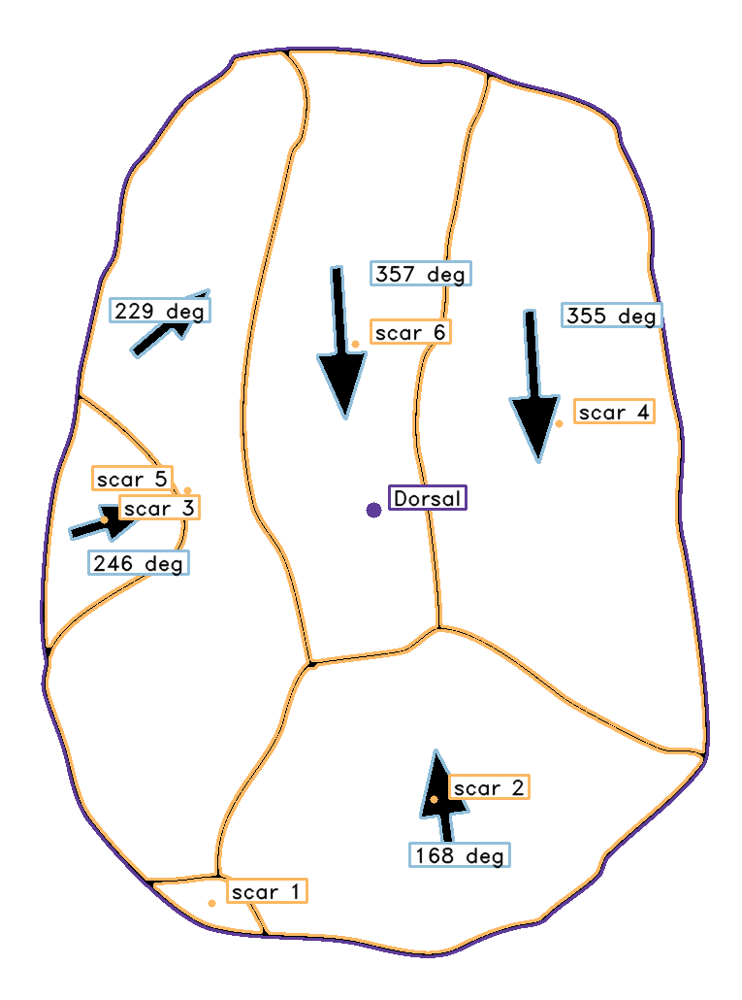
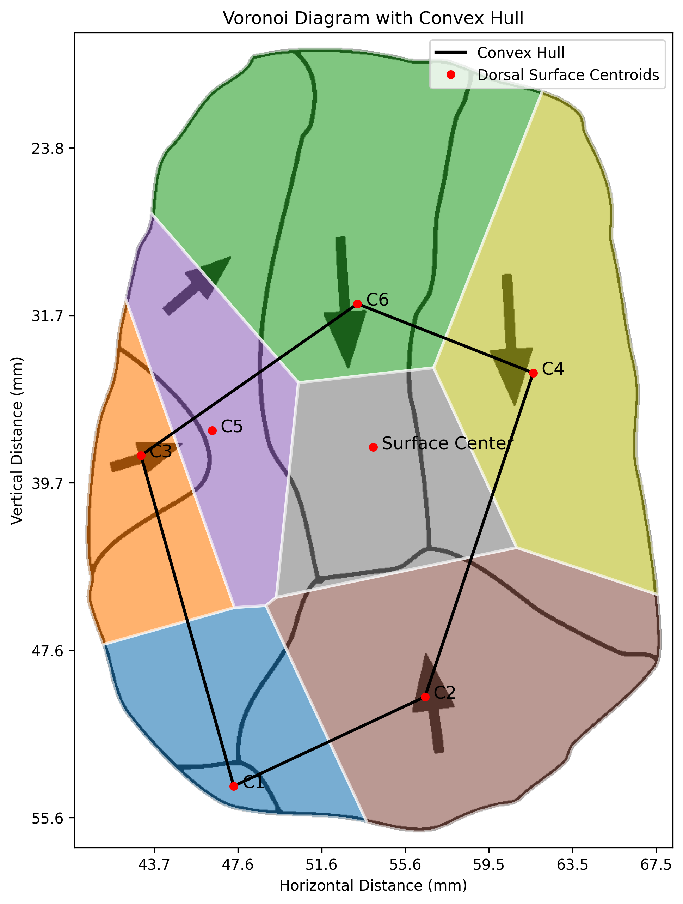

# PyLithics Outputs

## Overview

The analysis writes all its output to `results/` in your project
folder (`--data_dir`). This page gives each output file and how to read
it.

## The output directory

After an analysis:

```
my_project/results/
├── processed_metrics.csv          # The metrics for all images
├── pylithics.log                  # The log, for a person to read
├── run_summary.json               # A summary of the analysis, for a program to read
├── artifact_001_labeled.png       # The labelled image
├── artifact_001_voronoi.png       # The Voronoi diagram (dorsal surfaces only)
├── artifact_002_labeled.png
├── artifact_002_voronoi.png
└── json/                          # Only with --export_json
    ├── artifact_001.json
    └── artifact_002.json
```

### Debug output

The debug flags write images that show what each step found. All of
them follow one rule: **the folder is named after the flag that made
it, and the file is named after the source image.**

```
my_project/results/
├── threshold_debug/   --threshold_debug   the black-and-white image of each lithic
│   └── flake_001.png
├── scale_debug/       --scale_debug       the scale image with the bar that was found
│   └── scale_001.png
└── arrow_debug/       --arrow_debug       one folder for each lithic
    └── flake_001/
        ├── scar_1.png                     the arrow found in that scar, with its angle
        └── scar_1.txt                     the steps of the detection for that scar
```

`pylithics-pages --debug` follows the same rule in the project folder:
`my_project/pages_debug/<page>.png` is the plate with its numbered
boxes, scale bars and identifiers.

At the end of a run, each command names the debug folders that it
wrote.

`run_summary.json` is a small summary of the analysis: the time, the
number of images, the number of images with no errors, one entry for
each image, the metadata rows that carry a flag, and the images left
out because they have no scale value and you answered `n` to the
pixels question. The dashboard reads it for the numbers on its Overview
tab. Images with errors are not in `processed_metrics.csv`, so the
dashboard cannot count them from the CSV. The command writes a new
`run_summary.json` for each analysis. If you do not use the dashboard,
it is not necessary to read it. Other programs can read it too. Its
structure is simple.

## The main output: `processed_metrics.csv`

One CSV holds one row for each surface and each scar, for all the
images in the analysis. The tables below give each column that
PyLithics writes. A missing value is `NA`.

### Identification

| Column | Description |
|--------|-------------|
| `image_id` | The filename of the source image |
| `surface_type` | `Dorsal`, `Ventral`, `Platform`, `Lateral` or `Unclassified` |
| `surface_feature` | For a surface row, the surface name (for example `Dorsal`). For a child row, the scar, edge or cortex label (for example `scar 1`, `edge 2`, `cortex 1`) |
| `scar_count` | The number of scars on the dorsal surface (on the Dorsal surface row only) |

### Position and dimensions

| Column | Units | Description |
|--------|-------|-------------|
| `centroid_x` | mm or px | The X coordinate of the contour centroid |
| `centroid_y` | mm or px | The Y coordinate of the contour centroid |
| `technical_width` | mm or px | The maximum perpendicular width (surface rows only) |
| `technical_length` | mm or px | The distance from the platform to the distal end (surface rows only) |
| `max_width` | mm or px | The maximum dimension perpendicular to `max_length` |
| `max_length` | mm or px | The longest dimension, in any orientation |
| `total_area` | mm² or px² | The area inside the contour |
| `perimeter` | mm or px | The length of the contour |
| `aspect_ratio` | ratio | `technical_length` / `technical_width` |
| `distance_to_max_width` | mm or px | The distance from the platform to the point of maximum width |

The units are millimetres when the scale calibration is correct, and
pixels when it is not. The column `calibration_method` shows which.

### Voronoi and convex hull (Dorsal surface row only)

| Column | Units | Description |
|--------|-------|-------------|
| `voronoi_num_cells` | count | The number of Voronoi cells over the dorsal scars |
| `voronoi_cell_area` | mm² or px² | The area of the Voronoi cell that contains this row's centroid |
| `convex_hull_width` | mm or px | The width of the convex hull around the scar centroids |
| `convex_hull_height` | mm or px | The height of the convex hull |
| `convex_hull_area` | mm² or px² | The area of the convex hull |

### Symmetry (Dorsal surface row only)

| Column | Units | Description |
|--------|-------|-------------|
| `top_area` | mm² or px² | The filled area above the centroid |
| `bottom_area` | mm² or px² | The filled area below the centroid |
| `left_area` | mm² or px² | The filled area to the left of the centroid |
| `right_area` | mm² or px² | The filled area to the right of the centroid |
| `vertical_symmetry` | 0–1 | `1 − \|top − bottom\| / (top + bottom)` |
| `horizontal_symmetry` | 0–1 | `1 − \|left − right\| / (left + right)` |

### Lateral edge

| Column | Units | Description |
|--------|-------|-------------|
| `lateral_convexity` | 0–1 | The lateral surface area divided by the convex hull area |

### Cortex

| Column | Units | Description |
|--------|-------|-------------|
| `is_cortex` | bool | `True` for a child row that is cortex |
| `cortex_area` | mm² or px² | The area of the cortex |
| `cortex_percentage` | 0–100 | The cortex area as a percentage of the surface area |

### Arrows

| Column | Units | Description |
|--------|-------|-------------|
| `has_arrow` | bool | `True` if an arrow was found |
| `arrow_angle` | degrees | The angle in the PyLithics frame. See the note below |

!!! note "Arrow angle"
    `arrow_angle` is in a 0–360° frame like a compass, but the frame
    is turned. An arrow that points down in the image is `0`. An arrow
    that points right is `270`. Use `arrow_angle` to compare scars in
    the same image.

### Scar complexity

| Column | Units | Description |
|--------|-------|-------------|
| `scar_complexity` | count | The number of other dorsal scars in the adjacency distance |

### Scale calibration

These columns are present when scale bar calibration was tried:

| Column | Description |
|--------|-------------|
| `calibration_method` | `scale_bar` (millimetres) or `pixels` (no calibration) |
| `pixels_per_mm` | The factor used (empty when the calibration was not possible) |
| `scale_confidence` | The confidence of the scale bar measurement (0–1) |

### Arrow geometry (optional)

These columns are present only when arrow detection found the
triangle geometry for at least one scar:

`triangle_base_length`, `triangle_height`, `shaft_solidity`, `tip_solidity`

## The images

### The labelled image — `{image_stem}_labeled.png`

<div class="grid cards" markdown>

<div markdown>

The source image with the contours, the labels and the arrows drawn on it.

**Colours**:

- **<span style="color: rgb(94, 60, 153)">Purple</span>** — Surface (dorsal/ventral/platform/lateral)
- **<span style="color: rgb(253, 184, 99)">Orange</span>** — Scar
- **<span style="color: rgb(215, 48, 39)">Red</span>** — Cortex
- **<span style="color: rgb(128, 205, 193)">Mint Green</span>** — Lateral edge
- **<span style="color: rgb(178, 171, 210)">Light Purple</span>** — Platform mark
- **<span style="color: rgb(145, 191, 219)">Light Blue</span>** — Arrow

</div>

<div markdown>

{ width="300px" }

*The surface classification and the scars, drawn on the source image.*

</div>

</div>

### The Voronoi diagram — `{image_stem}_voronoi.png`

<div class="grid cards" markdown>

<div markdown>

A Voronoi tessellation of the dorsal scar centroids, with the convex hull.

- One cell for each centroid, cut at the edge of the dorsal surface
- The axes are in millimetres when the scale calibration is correct, and in pixels when it is not
- The convex hull is drawn around all centroids

</div>

<div markdown>

{ width="300px" }

*The Voronoi tessellation shows the spatial distribution of the scar centroids.*

</div>

</div>

## One JSON file for each lithic (optional)

With `--export_json`, PyLithics also writes one JSON file for each
lithic to `results/json/{image_stem}.json`. The CSV does not
change.

The JSON groups the metrics by surface and by feature. The calibration
is at the top level:

```json
{
  "schema_version": 1,
  "image_id": "awbari.png",
  "calibration": {
    "method": "scale_bar",
    "pixels_per_mm": 25.2,
    "scale_confidence": 1.0
  },
  "surfaces": [
    {
      "surface_type": "Dorsal",
      "surface_feature": "Dorsal",
      "centroid_x": 1361.76,
      "centroid_y": 957.21,
      "technical_width": 683.0,
      "technical_length": 936.0,
      "total_area": 525089.0,
      "scar_count": 6,
      "voronoi": {
        "num_cells": 7,
        "cell_area": 48384.82,
        "convex_hull_width": 468.98,
        "convex_hull_height": 576.02,
        "convex_hull_area": 165101.47
      },
      "symmetry": {
        "top_area": 257182.0,
        "bottom_area": 269162.0,
        "vertical_symmetry": 0.98,
        "horizontal_symmetry": 1.0
      },
      "lateral_convexity": null,
      "features": [
        {
          "surface_feature": "scar 1",
          "centroid_x": 1194.91,
          "centroid_y": 1362.25,
          "max_width": 33.38,
          "max_length": 120.02,
          "total_area": 3534.5,
          "voronoi_cell_area": 39808.67,
          "scar_complexity": 2,
          "is_cortex": false,
          "has_arrow": false
        }
      ]
    }
  ]
}
```

### The JSON structure

- **One JSON file for each lithic**, in `results/json/`.
- **`schema_version`** is `1`. It increases when the structure changes in a way that is not compatible.
- **`null` for a missing value.** Each JSON file has the same keys. `pd.json_normalize` and R `jsonlite::fromJSON` give rectangular data frames with no missing columns.
- **The Voronoi and symmetry blocks are in the Dorsal surface only.** They are `null` in the Ventral, Platform and Lateral surfaces.
- **`lateral_convexity`** is a number in a Lateral surface and `null` in the other surfaces.
- **Cortex children are in the `features` list of the Dorsal surface**, with `is_cortex: true`.
- **Booleans** (`is_cortex`, `has_arrow`) are JSON booleans, not strings.

### Read the JSON

```python
import json, pandas as pd

with open("pylithics/data/results/json/awbari.json") as f:
    doc = json.load(f)

# Flatten the dorsal features into a dataframe
dorsal = next(s for s in doc["surfaces"] if s["surface_type"] == "Dorsal")
features_df = pd.json_normalize(dorsal["features"])
```

```r
library(jsonlite)

doc <- fromJSON("pylithics/data/results/json/awbari.json",
                simplifyDataFrame = TRUE)

# Dorsal features as a data frame
dorsal <- doc$surfaces[doc$surfaces$surface_type == "Dorsal", ]
dorsal$features[[1]]
```

## The log: `pylithics.log`

The log has the full trace of each step for each image. The screen
output does not change this. Each analysis **replaces the previous
log**. The file always shows the most recent analysis only. To keep a
history, copy the file between analyses, or set a different `log_file`
in `config.yaml`.

**What goes where:**

- The log file: always DEBUG — each preprocessing step, each contour, each arrow, each cortex reading.
- The screen: INFO by default — the start data, one summary line for each image, and the summary at the end of the batch. Use `--verbose` (or `-v`) to show the DEBUG trace on the screen too.
- Third-party libraries (`PIL`, `matplotlib`, `fontTools`, `asyncio`): WARNING only. Their internal messages do not go to your log.

**Lines to search for:**

- `Output directory:` — where the analysis wrote its results
- `<image_id> · <px/mm>` — the summary line for one image at INFO (for example `awbari.png · 25.20 px/mm`)
- `pixels (no scale given)` — the image was analysed in pixels by design
- `pixels (scale bar not found — see the log)` — a scale was given, but the scale bar was not found. A `[WARNING] The scale image … is missing` or `No scale bar found in …` line comes before it
- `images analysed with no errors.` — the summary line at the end of the batch
- `[WARNING]` / `[ERROR]` — all messages above the default screen level

A log with no errors:

```
2026-06-19 10:33:15 [INFO] Config: default
2026-06-19 10:33:15 [INFO] Data directory: pylithics/data
2026-06-19 10:33:15 [INFO] Metadata file: pylithics/data/meta_data.csv
2026-06-19 10:33:15 [INFO] The input is correct
2026-06-19 10:33:15 [INFO] Output directory: pylithics/data/processed
2026-06-19 10:33:15 [DEBUG] Starting batch processing of 5 images
2026-06-19 10:33:15 [DEBUG] Processing image: awbari.png
... (per-step DEBUG trace for awbari) ...
2026-06-19 10:33:22 [INFO] awbari.png · 25.20 px/mm
2026-06-19 10:33:22 [DEBUG] Processing image: rub_al_khali.png
... etc. ...
2026-06-19 10:34:12 [INFO] qesem_cave.png · 25.20 px/mm
2026-06-19 10:34:12 [INFO] 5/5 images analysed with no errors.
```

If an image causes an error in the pipeline, the summary becomes
`<N_succeeded>/<TOTAL> images analysed with no errors.`, and a
`[WARNING] Images with errors: …` line lists the images.

## After each analysis

Make sure that:

1. **`processed_metrics.csv` is present** and has one row for each `image_id × surface_feature` that you expect
2. **Each `_labeled.png` is correct** — the surface classification agrees with the artefact, and there are no incorrect scars
3. **Each Dorsal surface row has a Voronoi diagram** if the surface has scars
4. **`calibration_method` is `scale_bar`** for the images that have scales, and not `pixels`
5. **Some measurements are plausible**: a flake is usually 10–200 mm long, with an area of 100–15,000 mm²

## Use the output data

### R

```r
data <- read.csv("pylithics/data/results/processed_metrics.csv")

# Surface counts
table(data$surface_type, data$surface_feature)

# Length × width on dorsal surfaces
dorsal <- subset(data, surface_feature == "Dorsal")
plot(dorsal$technical_length, dorsal$technical_width,
     xlab = "Length (mm)", ylab = "Width (mm)",
     col = as.factor(dorsal$image_id))
```

### Python

```python
import pandas as pd
import matplotlib.pyplot as plt

df = pd.read_csv("pylithics/data/results/processed_metrics.csv")

# Parent surfaces only
surfaces = df[df["surface_type"] == df["surface_feature"]]

plt.figure(figsize=(8, 6))
plt.scatter(surfaces["technical_length"], surfaces["technical_width"])
plt.xlabel("Length (mm)")
plt.ylabel("Width (mm)")
plt.title("Surface dimensions")
plt.show()
```

## Next steps

- [Glossary](glossary.md) — the definition of each column above
