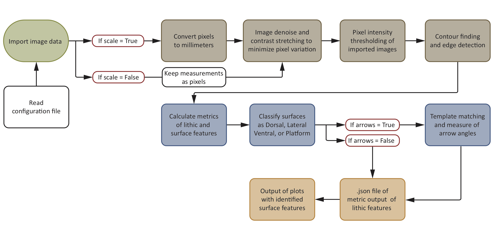

# Summary
Archaeologists have long used stone tools (lithics) to reconstruct the behavior of prehistoric hominins. While techniques have become more quantitative, there still remain barriers to optimizing data retrieval [@Andrefsky:2012]. Machine learning and computer vision approaches can be developed to extract quantitative and trait data from lithics, photographs and drawings. `PyLithics` has been developed to capture data from 2D line drawings, focusing on the size, shape and technological attributes of flakes. The problems addressed in the software are: 
one, capturing data in a form that can be quantified, and information maximized; two, solving the challenges of data that is not a simple linear sequence of bases but complex 3D objects or 2D image representations; and three, transforming and exporting these into systematic data for analysis. The goal is to enhance the size and quality of lithic databases for analyzing ancient technology and human behavior.

# Statement of need

`PyLithics` is an open-source, free for use software package for processing lithic artefact illustrations scanned from the literature. Accurately measuring lithic artefacts is difficult and especially time-consuming as lithics and their features are incongruous shapes and sizes. This is especially problematic for the researcher as certain features, such as flake scar size, are useful in elucidating the manufacturing process of an artefact. Thus, while even the best, most complete illustrations are able to visually capture an immense amount of information about an artefact, much of this information is under-utilized or not used at all. 

`PyLithics` alleviates these issues by accurately identifying, outlining, and computing lithic shape and linear measures, and returns user ready data. It has been optimized for feature extraction and measurement using a number of computer vision techniques including pixel intensity thresholding, edge detection, contour finding, custom template matching and image kernels. On both conventional and modern drawings, `PyLithics` can identify and label platform, lateral, dorsal, and ventral surfaces, as well as individual dorsal surface scar shape, size, orientation, diversity, number, and flaking order. Complete size and shape metrics of individual scars and whole flakes can be calculated and recorded. Orientation and flaking direction of dorsal scars can also be calculated. The resulting data can be used for metrical analysis, extracting features indicative of both typologies and technological processes. Data output can easily be employed to explore patterns of variation within and between assemblages.

# Methods and workflow

`PyLithics` is devised to work with illustrations of lithic objects common to publications in archaeology and anthropology. Lithic illustrators have established conventions regarding systems of artefact orientation and proportions. Lithics are normally drawn at a 1:1 scale, with the vertical axis orthogonal to the striking platform. A preferred method is to orient and illustrate various aspects of an artefact as a series of adjacent surfaces at 90-degree rotations from the principal view (usually the dorsal surface). Each aspect contains internal details (i.e., flake scars, cortical areas, etc.), indication of flaking direction radial lines (ripples), and the inclusion of a metric scale (for more information about lithic drawings see [@Martingell:1988]). Currently `PyLithics` is optimised to work with unifacial flakes and bifaces, which are relatively flat, two-dimensional objects. 

The inputs for `PyLithics` are images of lithic objects, images of their associated scales, and a metadata `CSV` file linking the two and giving the scale measurement in millimeters. 

`PyLithics` processes the images with the following steps and as illustrated in \autoref{fig:Figure_1}:

1. Import images and match image name to associated image ID and scale image from CSV metadata file.
2. Calculate a conversion of pixels to millimeters based on the size of the associated scale from CSV metadata file. If no scale is present, measurements will be in pixels
3. Apply noise removal and contrast stretching to images to minimise pixel variation.
4. Pixel intensity thresholding of images to prepare for contour finding.
5. Apply edge detection and contour finding to thresholded images.
6. Calculate metrics of lithic surface features from found contours -- area, length, breath, shape, number of vertices. 
7. Select contours which outline an entire lithic object's surfaces, or select contours of inner scars greater than 3% and less than 50% of the total size of its surface.
8. Classify these selected surface contours as "Dorsal", "Ventral", "Lateral", and/or "Platform" depending on presence or absence. Assign scar contours to these surfaces. 
9. If present, find arrows using connected components and template matching, measure their angle and assign angle to associated scar.
10. Plot resulting surface and scar contours on the original images for validation.
11. Output data in a hierarchical json file detailing measurements of surface and scar contours. 

The `PyLithics` depends on common Python packages such as NumPy
[@Harris:2020], SciPy [@Virtanen:2020], Pandas [@McKinney:2010] for data processing, Matplotlib [@Hunter:2007] for plotting and scikit-image [@scikit-image] and OpenCv [@opencv_library] for image processing and computer vision tasks.

# Results

`PyLithics` generates two outputs:

1. An image set comprised of the original input images with superimposed contour identification and derived metrics (see \autoref{fig:Figure_2} and \autoref{fig:Figure_3} as examples).
2. A JSON file with data for lithic objects and surface features found in each image. These data are hierarchically organised, first by type of object surface (i.e., ventral, dorsal, lateral, and platform); and second by metrics from scars and arrows associated to each object surface. 

Output images \autoref{fig:Figure_2} serve as validation of the output data \autoref{fig:Figure_3}.

{ width=100% }

{ width=100% }

# Outlook 

Evolutionary biology, and the study of human evolution in particular, has been transformed by the impact of genomics and the development of ancient DNA methodologies [@Moody:2004]. One of the reasons that genomics has had such an impact is the sheer scale of the data now available, and power of the analytical techniques used. Although current approaches to lithic analysis have become more quantitative, they remain based on relatively univariate attribute assignments and limited metrics, variably collected and reported. `PyLithics` aims to expand data collection with the goal of building expansive, comprehensive, and standardized high-dimensional lithic artefact datasets for integration with genomic and fossil data. 

# Acknowledgements

The `PyLithics` package was developed by researchers from The Alan Turing Institute, University of Cambridge, and the Leverhulme Centre for Human Evolutionary Studies. Funding was provided by the Alan Turing Institute (grant number G109254). We would like to acknowledge support from Professor Katharine Robson Brown and Doctor Sebastian Ahnert.

# References
